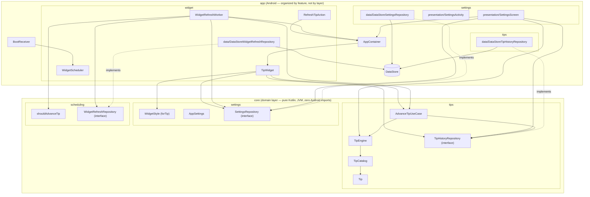

# SapGlance


> The name is settled: **SapGlance**, everywhere — `app_name` in `strings.xml` and
> `applicationId` (`com.sapglance.app`). The GitHub repo is still named `health-widget`;
> that's cosmetic, and renaming it would break existing clone URLs and the CI badge above
> for no benefit.

A privacy-first Android wellness app for students and desk workers: no accounts, no
tracking, no dashboards, no streaks, no notifications. Just a home-screen widget with one
rotating, [evidence-backed](TIP_SOURCES.md) tip.

## The privacy promise

**100% offline. Zero data collected.** No server, no analytics SDK, no crash reporter, no ad
SDK, and the manifest doesn't declare the `INTERNET` permission — a compromised dependency
couldn't phone home even if it tried. Tip history lives in on-device DataStore and is
included in Android's own encrypted device backup like any other app's local data — see
[PRIVACY.md](PRIVACY.md)'s "Backups" section for what that does and doesn't mean.

## v1 scope

v1 is intentionally passive — no notifications of any kind:

- A Glance home-screen widget showing the current tip. Tapping the tip card itself pulls a
  new one on the spot; a small gear icon opens the settings screen (AppWidgets can't
  intercept long-press, so a dedicated tap target is the only reliable way in).
- The tip advances on its own after it's actually had a chance to be seen — roughly every 90
  minutes of confirmed screen-on time since it was last shown, not a pure wall-clock timer
  that could rotate a tip nobody ever looked at (see "Notable design decisions" below).
- The widget's background is one of eleven styles — seven dark (Forest, Ocean, Sunset,
  Midnight, Aurora, Dawn, Rain) and four light (Winter, Paper, Meadow, Blossom) —
  deterministically derived from the currently-shown tip's text (`WidgetStyle.forTip`) rather
  than a user preference; a new tip means a new-looking card, not just new text. Not
  user-selectable; there's nothing to configure in Settings. The card's whole ink set (text,
  chip, frame, gear) flips with the style rather than following the phone's day/night theme:
  what the text has to contrast against is the artwork behind it, which the home screen's
  theme says nothing about. See `WidgetInk` in `TipWidget.kt`.
- Tips come from seven pools: four evidence-backed practical ones scoped by time of day
  (`general`/`morning`/`afternoon`/`evening`) plus three "tone" pools grouped by voice
  (`motivation`/`philosophy`/`wellbeing`). The Settings "More variety" control leans the mix
  towards tone without ever switching either group off, and the time of day decides *which*
  tone: motivation leads the morning, wellbeing and philosophy the evening and the small
  hours (see "Notable design decisions" below).
- A "Why this tip?" card in Settings showing where the current tip came from: every research
  source behind a practical tip (at least two), the quoted text behind a philosophy quotation,
  or nothing at all for an original motivational line — plus the tip's group and a button to
  pull a different tip on demand.
- The same tip never repeats within the last 30 shown.

Explicitly **not** in v1: accounts, streaks, gamification, history/progress views,
notifications, or any form of tracking.

## Architecture

Two Gradle modules, folders organized by feature (screaming architecture) with each
feature split into `data`/`presentation` layers that depend inward on `:core` (clean
architecture) rather than on each other's concrete classes:

- **`:core`** — the domain layer: pure Kotlin, JVM-only, zero Android imports. Grouped by
  concept, not by class kind:
  - `tips/` — `Tip` (text, a `TipKind`, and a `List<TipSource>` of citations — at least
    `Tip.MIN_SOURCES` of them for `TipKind.PRACTICAL`, none required for the tone kinds, see
    `TipCatalogTest`), `TipKind`, `TipEngine`, `TipCatalog`, `TipHistoryRepository`
    (interface), and `AdvanceTipUseCase`, the one "pick + persist the next tip" rule shared
    by every call site (the periodic tick worker, the widget's own tap-to-refresh, and the
    settings screen's manual refresh), so they can't silently diverge on anti-repeat (FR5).
    `TipHistoryRepository` tracks the last `MAX_RECENT_TIPS` (90) tips shown (by text) rather
    than just the single previous one. `TipEngine` excludes the most recent
    `ANTI_REPEAT_WINDOW` (30) of those outright — the FR5 guarantee — and weighs the rest by
    how long ago they were shown; the two constants are deliberately separate, see "Notable
    design decisions". `ToneProfile` holds the per-day-part tone mix.
    `TipEngine.findByText` resolves a persisted tip's text back to its full `Tip`
    (citation included) for the settings screen to display.
  - `settings/` — `AppSettings`/`SettingsRepository`, the one real persisted preference: a
    `VarietyLevel` (`PRACTICAL`/`BALANCED`/`PLAYFUL`), read by `TipEngine`'s weighting (see
    "Notable design decisions" below).
  - `widget/` — `WidgetStyle` (the eleven background styles and `WidgetStyle.forTip`'s pure
    hash-based mapping from a tip's text to one of them). It lived under `settings/` until the
    package pass, which was wrong in a way worth naming: it is explicitly *not* a setting —
    not user-configurable, not backed by a repository — so filing it under `settings/` meant
    the package said the opposite of what the type's own documentation said.
  - `scheduling/` — `TipRefreshSchedule` (`shouldAdvanceTip`, the tick-threshold math behind
    the ~90-minutes-of-screen-on-time tip advance) and `WidgetRefreshRepository` (interface),
    the persisted screen-on tick counter (see "Notable design decisions" below).
  Everything here is trivially unit-testable, and close to reusable by a future iOS port —
  though not literally "as-is": `java.time.LocalTime` and `TipCatalog`'s
  `Class.getResourceAsStream` are the two JVM APIs a Kotlin Multiplatform build would have to
  work around. See the iOS item under "Roadmap".
- **`:app`** — the Android application, organized by feature rather than by technical
  layer (`settings/`, `tips/`, `widget/`, `boot/`). Each feature splits the same way:
  `data/` holds the DataStore-backed implementation of the matching `:core` interface
  (`DataStoreSettingsRepository`, `DataStoreTipHistoryRepository`,
  `DataStoreWidgetRefreshRepository`), `presentation/` holds what the user actually sees, and
  `scheduling/` (widget only) holds the WorkManager plumbing. Dependents (workers,
  `AppContainer`, the settings screen) hold the `:core` interface type, never the concrete
  DataStore class, per the Dependency Inversion Principle.

  Two placements are deliberate rather than accidental, both settled in the package pass:

  - **`TipWidgetReceiver` stays at the `widget/` root** while the rest of the feature moved
    down into `presentation/`/`scheduling/`/`data/`. Its fully-qualified name is not an
    implementation detail — it is the `ComponentName` the launcher persists for every widget
    the user has placed, so renaming it makes Android find no matching provider on the next
    install and drop every placed widget off the home screen. A tidier package is not worth
    making people re-add their widgets.
  - **The Compose theme lives under `settings/presentation/theme/`**, not at the top level. It
    has exactly one caller (`SettingsActivity`) — the widget uses Glance's own `GlanceTheme`,
    not this one — so a top-level `theme/` package was naming a technical layer that only one
    feature used, which is the thing feature-first packaging exists to avoid.



Notable design decisions:

- **The tip only advances after it's actually had a chance to be seen.** A pure wall-clock
  timer could rotate a tip nobody ever saw (screen off overnight, phone face-down all
  afternoon), so `WidgetRefreshWorker` instead ticks every `TICK_INTERVAL_MINUTES` (15,
  WorkManager's own minimum periodic interval — there's no "notify me when the screen turns
  on" primitive, and a real screen-on/off listener can't survive process death without a
  foreground service) and only counts a tick if `PowerManager.isInteractive` is true at that
  instant. `shouldAdvanceTip` (`:core`, `TipRefreshSchedule.kt`) advances the tip once
  `TICKS_UNTIL_ADVANCE` (6) such ticks — ~90 minutes of confirmed on-screen time, accumulated
  across ticks rather than requiring one unbroken session — have collected since it was last
  shown. This is a sampling approximation, not a precise stopwatch (a tick only reflects the
  instant it fired), but it's simple, needs no extra permissions or a live receiver, and the
  count is persisted (`WidgetRefreshRepository`/`DataStoreWidgetRefreshRepository`), not held
  in memory, so it survives the process dying between ticks. See `TipRefreshScheduleTest`.
- **Concurrency-safe tip advancement**: `AdvanceTipUseCase` (`:core`) wraps its
  read-history/select-tip/persist-tip sequence in a `kotlinx.coroutines.sync.Mutex`, so
  concurrent callers (the periodic tick worker, the widget's own tap-to-refresh, a manual
  refresh from Settings) can't both read the same stale history and pick the same tip. The
  mutex lives on the single `AdvanceTipUseCase` instance `AppContainer` hands out (a `by
  lazy` singleton, already required for the anti-repeat rule to hold across callers), so
  every caller shares the same lock without each construction creating a new one. See
  `AdvanceTipUseCaseTest`'s concurrent-advances test, which launches N concurrent advances
  against an N-tip pool and asserts all N tips come out distinct — a real (if narrow) race in
  the old unsynchronized version.
- **Reactive widget rendering**: the widget observes the persisted tip from *inside*
  `provideContent` (`recentTips` → `collectAsState`) rather than reading it into a local in
  `provideGlance`. This is what actually makes the tip repaint. `provideGlance` runs once per
  Glance *session*, not once per `updateAll()`, so a tip captured above `provideContent` stays
  frozen for the session's entire lifetime: `updateAll()` only refreshes `AppWidgetSession`'s
  own `glanceState`/`options` holders, so a composition reading neither never recomposes and
  never emits new RemoteViews. That was the real cause of "the tip data updates but the widget
  doesn't repaint" — confirmed on-device with the widget stuck three tips behind DataStore
  while its `RemoteViews` instance never changed across a 15-minute window.
- **Concurrency-safe widget rendering**: pushing the widget's UI (`GlanceAppWidget.updateAll()`)
  is a separate step from picking the tip, and three independent triggers (the periodic tick
  worker, the manual "get a different tip" button, tapping the widget itself) can call it with
  no ordering guarantee between them.
  `AppContainer.refreshWidget()` wraps the push in its own `Mutex`, serializing every trigger
  through one call site. Each call still re-reads the current tip from DataStore at execution
  time rather than capturing a snapshot up front, so serializing just matters for the push
  itself: whichever call runs last always renders whatever is actually persisted, regardless
  of which trigger queued first.
- **A manual tip request always visibly changes something.** `TipEngine.messageFor`'s fixed,
  single-message sleep-hours tips (23:00-05:59) are exempt from anti-repeat by design for the
  passive scheduled rotation — there's only one possible message for each, so there's nothing
  to rotate. But that made an explicit tap-to-refresh (or the Settings refresh button) during
  those ~7 hours a silent no-op: the same fixed message came back every time with no visible
  change. `messageFor`/`AdvanceTipUseCase.invoke` now take a `manual` flag; when `true`, the
  sleep-hours day parts draw from the general pool instead of the fixed message, so an
  explicit request always changes the tip (and, since the background now follows the tip,
  the background too) regardless of time of day. The passive worker-driven rotation is
  untouched (`manual` defaults to `false`), so the wind-down message still shows normally
  when nobody asked for anything.
- **A tip's `TipKind` decides how it may be presented, so the citation model doesn't have to
  lie.** The catalog started as nothing but evidence-backed wellness advice, so every tip was
  required to carry 2+ research citations. That bar is right for "mild dehydration dents focus"
  and nonsense for "you're allowed to begin again": there is no study behind encouragement, and
  inventing one, or stretching a real paper to cover it, is exactly the dishonesty the citation
  requirement exists to prevent. So the requirement is per-kind (`TipKind.requiresCitation`),
  not global, and the Settings card reads `Tip.kind` to decide what to render underneath a tip:
  "Backed by N sources" for `PRACTICAL`, "Quoted from" for an attributed `PHILOSOPHY`
  quotation, and nothing at all for an original `MOTIVATION`/`WELLBEING` line. `TipCatalogTest`
  enforces each rule separately, including that a tone tip never carries research citations.
- **Tone pools keep their attribution inline; practical pools keep the two-file layout.** A
  practical pool's tips *all* have 2-3 sources, so a companion `*_sources.txt` keeps the tip
  text readable. A tone pool's tips *mostly* have none, so a companion file would be almost
  entirely blank — and since the loader strips blank lines, the two files would silently stop
  lining up, which is a genuinely nasty failure mode. Tone pools therefore put any attribution
  on the tip's own line (`Text<TAB>Label<TAB>URL`). The asymmetry is deliberate, not drift.
- **Quotations are only used where the attribution is checkable.** Popular philosophy quotes are
  misattributed constantly (the "journey of a thousand miles" line gets pinned on Confucius;
  several famous Marcus Aurelius one-liners are modern paraphrases with no matching passage), so
  `philosophy.txt` only quotes lines traceable to a specific chapter or letter in a
  public-domain edition, and cites that edition. Everything else in the pool is original
  reflection carrying no source and claiming none.
- **Selection is three narrowing weighted choices, and anti-repeat is applied before all of
  them.** `TipEngine` picks a *tier* (practical vs. tone), then a *group* within it (`general`
  vs. this hour's pool; motivation vs. philosophy vs. wellbeing), then a tip. The order is the
  load-bearing part: every group is filtered against the anti-repeat window *first*, then
  anything with nothing fresh left is dropped and its share redistributed among the survivors,
  and only then does any weighted draw happen. Weighting first and filtering second was a real
  bug — the draw could land on a group whose only unseen tips had just been shown and repeat one
  of those while another group still had fresh options sitting unused. The original fix was a
  hand-written empty check for each of the two groups that existed at the time; with five groups
  there are simply more places for it to come back, so it is now structural (`availableTiers`)
  rather than a special case per group, and covered at both tier and group level in
  `TipEngineTest`. Only once *nothing* anywhere is unseen does selection fall back to the
  unfiltered pools, which necessarily repeats something.
- **The "more variety" setting is a lean, never a filter.** `VarietyLevel` sets the tone tier's
  share of a draw (`PRACTICAL` 20% / `BALANCED` 50% / `PLAYFUL` 80%) rather than switching either
  tier on or off — even `PRACTICAL` lets a motivation/philosophy/wellbeing tip through
  occasionally, even `PLAYFUL` leaves room for a practical one, so every level reads as "mostly
  this" rather than "only this." It deliberately stays a three-way choice even though there are
  now four kinds of tip to distribute across: per-group weights would be three more controls for
  a judgement the user has no basis to make ("how much Stoicism, exactly?"), on a settings screen
  that is one card, in an app whose whole philosophy is minimal settings. The finer distribution
  is made by the defaults instead, below.
- **Which tone suits the hour is an editorial judgement, not a setting.** The three tone pools
  used to be concatenated and weighed as one blob, so a tone draw was equally likely to be a
  motivational push, a Stoic quotation, or a quiet wellbeing invitation regardless of the time —
  and "Stop researching it. Go and do it badly." at 23:40 doesn't read as variety, it reads as
  the app not knowing what time it is. `ToneProfile.forDayPart` now splits the tone share by day
  part: motivation leads the morning and fades across the day, wellbeing and philosophy do the
  reverse. The sleep-hours profile zeroes motivation outright, which is the one place this table
  filters rather than leans — "Two minutes. Set a timer. Go." at 3am is not a weaker version of
  good advice, it's the opposite of what the hour calls for. That doesn't contradict the rule
  above, which is a promise about what the *user's setting* can do; no `VarietyLevel` ever
  silences a group. `ToneProfileTest` pins it so a later tuning pass can't soften it by accident.
- **Night is no longer the one unpersonalized corner of the app.** 23:00-05:59 used to show a
  single fixed wind-down message every time, for ~7 hours. It now runs through the same machinery
  as every other day part, with the fixed message as a one-tip practical group (still exempt from
  anti-repeat — there is nothing to rotate, and excluding it after one showing would delete the
  wind-down nudge for the rest of the night) weighed against philosophy and wellbeing. Night uses
  a much higher tone share than daytime at every level (50/70/85 rather than 20/50/80), because
  its practical side isn't a pool: at the daytime split the user would see the *identical*
  sentence four nights in five. At the default level the wind-down message is still the single
  most likely thing to see at 2am (~50% of draws), just no longer the only thing. Growing the
  sleep messages into real cited pools is still open — that's content work at the
  TIP_SOURCES.md evidence bar, not selection work.
- **`general` and the day-part pool split the practical tier evenly, rather than by pool size.**
  The two used to be concatenated and drawn from uniformly, which let file sizes set the ratio:
  `general` is roughly twice the size of any single day-part pool, so about two thirds of
  practical draws came from the most time-neutral content in the catalog and the tips actually
  *about* right now were the minority every hour of the day. Nothing intended that, and it would
  have drifted again with every content pass. The split is now a stated constant.
- **Recency weighting, not a shuffled bag.** Within a group, tips are weighted by how long it's
  been since they were shown, rising from just-out-of-the-window to the far edge of what history
  remembers; a tip never shown at all counts as maximally overdue. Uniform random is
  maximum-entropy *per draw*, but says nothing about the gaps *between* draws — a tip could leave
  the anti-repeat window and come straight back on the very next pick while another went months
  unseen, and it's the early returns a user notices as "I keep seeing the same ones." Simulated
  over 40k draws against the real catalog, this halves them: returns landing within 15 draws of a
  tip becoming eligible again drop from 28.4% to 13.1%, and the worst-case gap between showings
  of one tip falls from 831 draws to 640. Long-run *usage* evenness barely moves, because uniform
  random was already even in aggregate — the clustering was always in the gaps, not the totals.
  A shuffled bag (deal the pool in a random permutation, reshuffle when exhausted) was the other
  candidate and was rejected on three counts: the pool that matters is composed (`general` +
  whichever day-part pool) and changes four times a day, so a deck over it gets abandoned
  mid-deal; a deck per source pool then needs its own inter-deck weighting, which is the same
  problem again; and it fights the anti-repeat window, since a card that comes up while still
  inside the window has to be skipped, breaking the "every tip exactly once per cycle" guarantee
  that was the whole reason to reach for a bag. It would also have needed new persisted state,
  where weighting reuses the history that is already stored.
- **How much history is remembered and how far the no-repeat rule reaches are two numbers.**
  `TipHistoryRepository.ANTI_REPEAT_WINDOW` (30) is the product guarantee (FR5);
  `MAX_RECENT_TIPS` (90) is how much is stored. They used to be one constant, which made recency
  weighting impossible in principle rather than merely unimplemented: everything inside the
  window is hard-excluded, so a history exactly as long as the window carries no usable signal at
  all — every eligible tip looks equally unseen and selection can do no better than uniform.
  Keeping them separate also means growing the memory to improve how varied selection *feels* can
  never quietly widen or narrow the guarantee itself, which `TipEngineTest` checks in both
  directions. The cost is 60 more tip texts in local storage; see [PRIVACY.md](PRIVACY.md).
- The Glance widget's `updatePeriodMillis` is set to `0`; refresh is driven entirely by
  `WidgetScheduler`'s own 15-minute WorkManager periodic job (see the tip-advance tick model
  above), since the AppWidget framework's own update period has an unreliable 30-minute floor.
- Tip content lives in bundled plain-text resources (`core/src/main/resources/tips/*.txt`
  plus a line-for-line `*_sources.txt` citation file per pool), not a JSON asset, to avoid
  pulling a JSON dependency into a module whose whole point is to stay dependency-free.
  Every non-obvious claim a tip makes is cited in [TIP_SOURCES.md](TIP_SOURCES.md),
  organized by theme rather than by file, and enforced in code (`TipCatalog.loadDefault`,
  `TipCatalogTest`) so a tip can't ship without one.
- **Every tip carries at least two independent citations, and sources repeat across tips on
  purpose.** One citation reads as one study's opinion, which isn't much of an evidence claim
  to put on someone's home screen; two or three sources that independently agree are. A source
  line in `*_sources.txt` is therefore one or more `Label<TAB>URL` pairs tab-separated end to
  end (an even field count), preserving the one-line-per-tip correspondence, and `Tip.sources`
  is a `List<TipSource>`. `TipCatalogTest` enforces the `Tip.MIN_SOURCES` floor, HTTPS URLs,
  and that a tip's own sources are distinct from each other — citing the same URL twice would
  otherwise satisfy the count without adding evidence. The same meta-analysis legitimately
  backing a dozen sitting-related tips is expected and fine. Source-quality rules (primary
  study over press release; no Wikipedia/ResearchGate/aggregator pages; consumer health sites
  only alongside a peer-reviewed primary) are written up in TIP_SOURCES.md, along with the four
  claims a source-by-source audit found were wrong, overstated, or contradicted by the very
  study they cited.
- There's no DI framework (`AppContainer` is a hand-written composition root) and no
  ViewModel (the settings screen collects `Flow`s directly) — both are deliberately skipped
  as unnecessary weight for an app this size, not oversights.
- The widget's background is one of nine real `<layer-list>` drawable resources, selected by
  `WidgetStyle.forTip` (`Math.floorMod(tipText.hashCode(), entries.size)`) rather than a
  stored preference — the same tip text always renders the same style, and there's no Settings
  UI for it any more since there's nothing left to choose. Adding a style therefore reshuffles
  which tip draws which background, which is harmless precisely because nothing persists one.
- **Backup policy**: the app opts in to Android's built-in backup system and explicitly
  includes settings + tip history in both `backup_rules.xml` (legacy, API < 31) and
  `data_extraction_rules.xml` (API 31+) — chosen over excluding this data, since it's the
  option consistent with the project's existing "your local settings/history, backed up
  like any other app's" framing, and it's all non-sensitive. Both files previously pointed
  at `domain="sharedpref"`, which matched nothing (the app has no `SharedPreferences` at
  all — settings and tip history are Preferences DataStore, stored under `files/datastore/`,
  not `shared_prefs/`), so backup coverage looked configured but silently did nothing; both
  now correctly use `domain="file" path="datastore/"`. See [PRIVACY.md](PRIVACY.md)'s
  "Backups" section for what this does and doesn't mean for the user — notably, this is the
  one case where locally-stored data can leave the device (via Android's own backup
  service), which the policy is written to state plainly rather than gloss over.

## Tech stack

Kotlin · Jetpack Compose (Material 3) · Glance · WorkManager · DataStore (Preferences) ·
Gradle Kotlin DSL with a version catalog (AGP 8.10.1, Gradle 8.11.1). `minSdk 26`,
`compileSdk`/`targetSdk 36`.

## Building

Requires JDK 17.

```bash
./gradlew build
```

## Testing

```bash
./gradlew test        # unit tests (TipEngine has full branch coverage — see core/src/test)
./gradlew ktlintCheck # formatting
./gradlew lint        # Android lint
```

CI (`.github/workflows/ci.yml`) runs all three plus a full build on every push and PR.

## Roadmap

- [x] A motivational/philosophical quote pool, aimed specifically at lowering stress and
      lifting mood — a new tone alongside the practical wellness tips, not a replacement for
      them. Landed as **three** pools rather than one, grouped by voice: `motivation.txt` (53),
      `philosophy.txt` (42, thirty-two of them attributed public-domain quotations),
      `wellbeing.txt` (55). Each file carries its writing rules as header comments — its voice,
      how to keep it varied, and how far its humour may go — and `TipCatalogTest` guards the one
      that's checkable (philosophy stays majority-quotation). Selection now treats the three as
      genuinely different things rather than one blob — see the tone-algorithm item below.
- [x] Introduce a `TipKind` so non-evidence content is presented honestly instead of being
      forced through a citation model that only fits evidence-backed health tips. Done as part
      of writing the content, as planned: `TipKind` is `PRACTICAL`/`MOTIVATION`/`PHILOSOPHY`/
      `WELLBEING`, and `requiresCitation` is true only for `PRACTICAL`. The
      "quotation vs. reflection" distinction the original note wanted turned out not to need
      its own kind: within `PHILOSOPHY`, a quotation carries exactly one source (the
      public-domain text it came from) and a reflection carries none, which the UI already
      renders differently ("Quoted from" vs. nothing).
- [x] Lighter, more openly humorous content. The three tone pools that landed are warm but
      earnest; none of them was actually *funny*, and the `PLAYFUL` variety level arguably
      promised a lightness the content didn't deliver. Done as a pure content change, as
      predicted: no structural work, no new `TipKind`, no new pool. `wellbeing.txt` gained a
      **Lighter** group (8 lines) and `motivation.txt` a **Wry** group (5 lines that still
      push). Each file carries a new header rule for its group, because the "grating on a bad
      day" risk is real and specific: humour that needs the reader to be having a bad day to
      land, or that is at the reader's expense, breaks the rules those pools already had.
- [ ] Sleep-hours messages (`sleepLate`/`sleepEarlyHours`) are still one fixed `Tip` each,
      deliberately exempt from anti-repeat. **Mostly addressed** by the tone-algorithm work
      below, from the other direction than this note assumed: rather than growing the practical
      wind-down content, night now runs through the same selection machinery as every other day
      part, with the fixed message weighed against the philosophy and wellbeing pools and
      motivation excluded entirely. Night is no longer the unpersonalized corner — at the
      default level the fixed message is ~50% of night draws rather than 100%. What's still open
      is the original literal ask: turning the two messages into real *practical* pools. That's
      content work at the TIP_SOURCES.md evidence bar (each new tip needs two independent
      primary citations), deliberately kept separate from the selection change so the two don't
      get entangled.
- [x] More tips in the existing pools (general/morning/afternoon/evening). The near-duplicate
      pass below replaced repeats rather than growing the pools, leaving them flat at
      41/23/22/23. Now **50/26/26/28** (109 practical tips to 130), chosen to fill topic gaps
      rather than restate covered ground. First pass: time outdoors, social connection, acts of
      kindness and dietary fibre (general); muscle-strengthening (morning); short vigorous
      bursts and music for stress (afternoon); evening exercise timing, night mode vs screen
      brightness, and short sleep vs colds (evening). Second pass, aiming for *precision* over
      generality: cyclic sighing, paper vs screen reading, blue-light glasses, background
      speech and office temperature (general); sleep inertia and social jetlag (morning); the
      caffeine nap and the insight/analysis time-of-day split (afternoon); light during sleep
      and bedroom noise (evening). Every one carries two independent citations verified against
      the primary literature, written up in [TIP_SOURCES.md](TIP_SOURCES.md). Two candidates
      were dropped rather than written: a handwriting-versus-typing tip, because Mueller &
      Oppenheimer (2014) failed to replicate in 2019, and a morning-spinal-flexion tip, because
      the sourcing was thinner than the confident phrasing it invited.
- [x] More background styles beyond the original four (Forest/Ocean/Sunset/Midnight). Now
      **eleven**, in two families, taking their cue from the backdrop set in the Easy-poems
      workshop: seven dark (the original four plus Aurora, Dawn and Rain) and four light
      (Winter, Paper, Meadow, Blossom). Each is built the same way (a `<layer-list>` of base
      gradient + radial glows + a `widget_art_*` vector + accent dots + a footer scrim + the
      card frame) and claims palette territory the originals didn't hold. Adding the light
      family meant the card's ink had to stop being hardcoded white — see the ergonomics
      item below. Because `forTip` is `hashCode() mod entries.size`, adding entries
      reshuffles which tip gets which background; nothing persists a style, so that's free.
- [x] Make the card's text legible on every style, not just the dark ones. The widget
      hardcoded white text on a translucent *black* chip, which silently assumed every
      background would stay dark. `WidgetInk` (in `TipWidget.kt`) now flips the whole set
      together — text, chip polarity, card frame, and the settings gear's chip and glyph —
      paired with each style's drawable in one exhaustive `when`, so a new style can't ship
      having picked a background and forgotten its ink. Contrast was measured rather than
      eyeballed, compositing each background's real layer stack at the points where text
      actually sits: that found the **app-name label failing on two shipped styles**
      (Ocean 2.7:1, Dawn 2.7:1 — it's the only text with no chip of its own, and it sits on
      the bottom edge where these scenes put their brightest art). Fixed with a bottom-edge
      scrim on every background plus a footer alpha bump; all eleven styles now clear WCAG
      AA at 4.5:1, worst case 4.9:1.
- [x] Remove em dashes from all app-facing text. Done for bundled tip content and enforced by
      `TipCatalogTest`'s "no tip text contains an em dash" case so it can't regress;
      `strings.xml` already had none. Docs still use them, deliberately — they're prose for
      maintainers, not app-facing text.
- [x] Audit the tip pools for near-duplicates — tips that gave essentially the same advice in
      different words, which `TipCatalogTest`'s exact-text-duplicate check never caught. Roughly
      a third of the catalog was rewritten: verbatim-ish pairs were removed outright (two
      "outdoor light is brighter than indoors" morning tips, two "a short chat lifts the
      afternoon" tips), and the remaining clusters were differentiated by *register* rather than
      merged, so an action tip and the evidence tip behind it now say different things (e.g.
      "jot down tomorrow's top task" and the nine-minutes-faster sleep-lab finding; five
      overlapping "take a break" tips now cover the walk, the eye rest, the mechanism, the
      quiet minute, and when to break).
- [x] **Rewrite the clichés out of the practical pools.** The tone pools were explicitly
      de-cliché'd; the practical ones never were, and roughly a sixth of their 130 tips were
      lines the reader had already met on every ergonomics poster and sleep-hygiene leaflet.
      Done as a register change, not a topic cull: posture, hydration, breaks and morning light
      are clichés precisely because they're true, so they all stayed, and what the lines *say*
      about them changed. Nine rewrites, 1:1 with no net cut (`ANTI_REPEAT_WINDOW` is 30, so
      shrinking the pools would make rotation feel worse, not better):
      - "Check your posture: ears, shoulders, and hips roughly stacked" became "Sitting up
        straight isn't the goal. Neutral and supported beats upright and held."
      - "Open the curtains. Even a grey day outdoors is far brighter than any lit room" became
        "An overcast day is around 10,000 lux. A bright office is 500."
      - "Take 3 slow, deep breaths" became "Slow to about six breaths a minute. That's where
        heart-rate variability peaks" — which is what its own citation already said.
      - "Dimming lights and screens in the evening helps your body start winding down" became
        "Room light before bed shortened melatonin release by about 90 minutes in one study",
        the actual headline finding of the Gooley paper already attached to it.
      - The 20-20-20 line now says the benefit faded a week after people stopped, which is what
        the trial cited beside it found. The roadmap flagged that rule as worth re-checking from
        the sceptical side; it was, and the honest version is more interesting than the poster.
      - Plus chair-height, screen-height, blink and fibre lines rewritten to a mechanism or a
        number.
      **Two of these were factual corrections, not just style.** "Coffee only half counts" was
      cited to two papers about dehydration and cognition that say nothing about caffeine, and
      is wrong on the evidence: it now says coffee counts toward your fluids, cited to Killer et
      al. and Maughan & Griffin. "Keep water within arm's reach. You drink more when reaching
      for it is free" carried the same two cognition papers, which do not support a claim about
      reaching distance. Both are recorded in TIP_SOURCES.md's "Corrections" section.
      **Enforcement is a header rule, not a test**, since a lint for "boring" would be gameable
      nonsense. `tips/general.txt` now carries the full rule (the four registers a line must hit
      — bust a myth, name a mechanism, carry a real number, invert an assumption — plus "change
      the register, keep the topic" and a warning that the evidence bar does not move to make a
      line interesting); the other three practical files point at it and add their own cluster
      warning, and it is mirrored into CONTRIBUTING.md's "Adding a tip" list. The practical
      files' headers were two lines of mechanical bookkeeping before, which is why nothing
      pushed back when the poster lines went in.
      **Still open**: the clusters are thinned, not resolved. `morning.txt` still carries six
      morning-light lines and `afternoon.txt` five "get up / move" lines; both now have a header
      warning telling the next person to rewrite one rather than add a seventh.
- [x] **Rework how a tip is chosen, now that the tone pools exist.** Done, from the brief in
      [docs/TONE_ALGORITHM_PROMPT.md](docs/TONE_ALGORITHM_PROMPT.md). Selection is now three
      narrowing weighted choices (tier, then group, then tip) with anti-repeat applied to every
      group before any of them; the three tone pools are split by time of day
      (`ToneProfile`) instead of concatenated into one blob; `general` and the day-part pool
      split the practical share evenly instead of by file size; and uniform random within a pool
      became recency weighting over a 90-tip history, which halves the early returns that made
      rotation feel repetitive. A shuffled bag was considered and rejected; `VarietyLevel`
      deliberately stayed a three-way choice rather than gaining per-group weights. Full
      rationale for each, including what was rejected and why, is in "Notable design decisions"
      above.
- [x] **Measured on-device where the tip-refresh time actually goes.** Done with real logcat
      timings on a Galaxy A34 (temporary instrumentation, since removed). The headline: **it is
      mostly not our code.** A cold start reaches Glance's `provideGlance` about **1036ms** into
      the process, and the activity's total cold start is ~1263ms — process creation plus
      Glance's own session setup dominate, and neither is something the app controls. Of the
      rest: `TipCatalog.loadDefault()` **122ms** on its first call, `recentTips.first()` (the
      first DataStore read) **46ms**, `updateAll()` **35-115ms**.

      Two things this corrected. The catalog parse is **25-40× worse on ART than on the desktop
      JVM** (122ms vs 3-5ms), not the 10-20× guessed above. But repeating that same parse costs
      only ~55ms, so roughly 65ms of the first call is one-time class loading and JIT rather
      than work — which is why "make the parse faster" is the wrong lever and *"stop making the
      tap wait for it"* is the right one. That is what `AppContainer.warmUp()` now does.

      Deliberately **not** done, both recorded so they aren't rediscovered as ideas: collapsing
      the 15 tip resources into one packaged file would save maybe 45ms of zip-entry opens, but
      needs a Gradle concatenation step to preserve the one-file-per-pool authoring format with
      its editorial headers — real build complexity to optimise work `warmUp` already hides
      behind the ~1s of process start. And dropping the `updateAll()` call when a Glance session
      is already live would save 35-115ms, but risks re-opening the "widget doesn't repaint" bug
      that took several attempts to fix, which is a bad trade at this size.
- [ ] **Make a cold tap *feel* faster, given ~1s of it is process start.** The measurement above
      says the remaining win isn't in shaving milliseconds off our own code — it's that a tap on
      a dead process cannot repaint quickly no matter what selection does. Open question, no
      obvious answer yet: a Glance widget has no cheap way to acknowledge a tap before its
      process exists, and the alternatives that would (a foreground service, a persistent
      process) are exactly what this app refuses to be.
- [ ] Widget size variants (small/medium) via Glance's responsive sizing. Worth knowing while
      doing it: the tip text is the constraint. The card spends roughly 90dp on chrome (16dp
      padding top and bottom, the `❝` glyph and its spacer, the chip's own padding, the
      app-name label) before a line of tip is drawn, against a declared `minHeight` of 90dp, so
      six lines of 15sp cannot fit at the small end of the range the widget advertises. The
      catalog is now capped at ~90 characters a tip, which keeps ordinary tips inside two or
      three lines and was the cheap fix; dropping the decorative chrome at small sizes is the
      structural one, and belongs with this item rather than as a separate job.
- [ ] **Languages beyond `en`.** The UI half is nearly free: every user-facing string is
      already externalized to `app/src/main/res/values/strings.xml` (one decorative `❝` glyph in
      `TipWidget.kt` aside), so a `values-<lang>/strings.xml` per locale is all Android needs,
      and Glance reads the same resources as the settings screen. The *content* half is the
      actual project, and it isn't an Android-resources problem at all: the 282 bundled tips
      live in `core/src/main/resources/tips/*.txt` and are read through
      `TipCatalog::class.java.getResourceAsStream("/tips/…")` — a JVM classpath lookup that
      knows nothing about `Locale` and would happily keep serving English tips on a Spanish
      phone under a fully translated UI. Sketch of the work, roughly in dependency order:
      - **Locale-aware catalog loading.** `TipCatalog.loadDefault()` takes no arguments today.
        It needs a locale passed *in* from `:app` (not read from a global — `:core` stays
        Android-free and JVM-pure, which is also what keeps it portable) and a per-locale
        resource path (`/tips/es/general.txt`), with an explicit per-pool fallback to the
        English file so a partially translated locale degrades to mixed-language rather than
        crashing on `require(...) { "Missing bundled tip resource" }`.
      - **Tip history is keyed by text, not by an id.** `TipHistoryRepository.recordTip(String)`
        stores the last 90 tip *texts*, so changing the phone's language invalidates the entire
        history at once: nothing in the new catalog matches, the FR5 anti-repeat guarantee
        quietly restarts from empty, and `TipEngine.findByText` stops resolving the
        currently-shown tip, so "Why this tip?" loses its citation half until the next tip
        advances (the card itself already survives a null match — see `SettingsScreen.kt`).
        Also `WidgetStyle.forTip` hashes the text, so the same tip gets a different background
        in each language. Either accept all of this as a rare one-time cost and document it, or
        give `Tip` a stable id and migrate the history onto it — the second is the larger
        change and the only one that also fixes the existing "history breaks on a wording edit"
        case.
      - **Translating the pools is three different jobs, not one.**
        - *Practical* tips each carry ≥2 citations to English-language primary literature. The
          tip text translates; the sources don't. Pointing a Spanish tip at an English PubMed
          abstract should be a deliberate decision rather than an accident — probably the right
          one, since the evidence is the paper, not the language it's written in.
        - *Philosophy* is majority public-domain quotation, each pinned to a specific edition,
          and `TipCatalogTest` enforces that majority. A quotation can't just be translated and
          keep its attribution: the citation would then point at an English edition whose words
          those aren't. Each target language needs its own public-domain translation (or the
          Greek/Latin original) per line — real research, not a pass over the file — or
          philosophy ships as a smaller pool in that locale.
        - *Motivation* and *wellbeing* are original writing with no citation bar: cheapest to
          translate, easiest to get tonally wrong. Each file's header rules (its voice, how to
          keep it varied, how far its humour may go) are the spec, and have to travel with the
          text to the translator.
      - **The two sleep messages** are single fixed lines rather than pools, and `sleep_late.txt`
        opens with "It's past 11 PM" — a 12-hour clock heading for locales that don't use one.
      - **Tests and the length envelope.** `TipCatalogTest` asserts against `loadDefault()`,
        i.e. English only; every guard it holds (no duplicates within or across pools, ≥2 real
        sources, no em dashes, philosophy stays majority-quotation) needs parameterizing over
        locales, or the translated catalogs ship with none of the checks the English one can't
        regress past. The widget renders tips at a fixed `TIP_FONT_SIZE` (15sp, `maxLines = 6`),
        which is what makes the current ~50-115 character envelope work; German and Russian
        typically run 20-30% longer than English, so a per-locale max-length test earns its
        keep here in a way it never did for `en` alone.
      - **Which languages is still open.** A sensible first wave is `es`, `pt-BR`, `de`, `fr`,
        `ru`, but the binding constraint is *review* capacity, not translation supply: an
        unreviewed machine translation of an evidence-backed health claim is exactly what this
        project's content history has consistently refused to ship. One language done properly
        beats five done automatically. Nothing here is blocked on the decision — the loader,
        history, and test work above are the same for any target list.
      - **The Play listing localizes separately** from the app (per-locale listing text and
        screenshots in Play Console), and `PRIVACY.md` is English-only.
- [ ] Low priority, no urgency either way:
      - Reconsider the "More variety" section title now that it's a three-way `VarietyLevel`
        picker (Practical/Balanced/Playful) rather than an on/off toggle — the original naming
        concern was about a binary switch reading as "only this," which the three labeled
        levels plus the state description under them already resolve most of. Bikeshed, not a
        fix.
      - ~~Tighten the iOS-port claim below ("plain enough to port directly" slightly
        overstates it).~~ Done, as part of writing the iOS plan below — the claim is now
        stated with the two JVM APIs that actually block it.
- [ ] **iOS port** via WidgetKit + App Intents. Sequenced deliberately **after** the Play
      Store launch: this is the only roadmap item gated on hardware and money rather than on
      work, since Xcode is macOS-only (nothing here can be built, run, or submitted from the
      Windows machine this repo lives on) and the Apple Developer Program is $99/year
      recurring against Google's $25 once. Shipping the Android app first is what tells you
      whether the second platform is worth that.
      - **`:core` is genuinely close to portable, but "reusable as-is" was always an
        overstatement.** An audit of the module turns up exactly two JVM dependencies:
        `java.time.LocalTime` (`TipEngine`, `AdvanceTipUseCase`) and the resource loading in
        `TipCatalog` (`Class.getResourceAsStream`, `Charsets.UTF_8`, `bufferedReader`).
        Everything else — `Flow`, `Mutex`, `kotlin.random.Random`, the data classes, all of the
        selection math — is already multiplatform-safe. So the KMP move is: swap the
        `kotlin.jvm` plugin for `kotlin.multiplatform` with `jvm()` and `iosArm64()`/
        `iosSimulatorArm64()` targets, `expect`/`actual` the catalog loader, and swap
        `java.time` for `kotlinx-datetime`.
      - **The hidden cost is the test suite, not the main source.** `:core`'s tests are the
        project's real safety net, and they're JUnit 5 + Truth + `java.util.stream.Stream`
        parameterized cases — none of which runs on Kotlin/Native. Moving the suite into
        `commonTest` means rewriting it on `kotlin.test`, and that is a larger and much less
        interesting job than porting the logic it guards.
      - **The ~90-minute screen-on rule does not survive the crossing, and this is a product
        decision rather than a porting detail.** Android counts 15-minute WorkManager ticks and
        only credits the ones where the screen was actually on (`TipRefreshSchedule`). WidgetKit
        has no equivalent: a widget supplies a *timeline* of future entries, the system decides
        when to render them against a daily refresh budget, and there is no screen-state signal
        and no background execution to sample one with. iOS would therefore get wall-clock
        rotation — precisely the design this project rejected on purpose, because it rotates
        tips nobody looked at. Either accept a weaker guarantee on iOS and document it, or
        rethink the rule as something both platforms can honour.
      - **Tap-to-refresh sets the floor at iOS 17.** Interactive widgets (a `Button` bound to an
        App Intent) only exist from iOS 17; before that, a widget tap can do nothing but
        deep-link into the app, which would remove the core interaction rather than degrade it.
      - **Two processes, not one.** The widget extension and the app are separate processes, so
        settings and tip history have to live in a shared App Group container (UserDefaults or a
        file) or the widget simply cannot read them. That also breaks `AdvanceTipUseCase`'s
        concurrency guarantee: its `Mutex` serializes read-select-persist *within one process*,
        which was sufficient on Android and is not on iOS — the race it was written to prevent
        comes back and needs cross-process coordination.
      - **The nine widget styles are Android artwork.** `WidgetStyle.forTip`'s hash-based
        mapping is pure `:core` and ports free; the `widget_background_*.xml` / `widget_art_*.xml`
        drawables do not, and need reimplementing as SwiftUI. Worth knowing before designing for
        it: iOS 17 applies its own content margins, and Lock Screen / StandBy widgets render
        monochrome, so a gradient-card design doesn't survive into those contexts at all.
      - **The privacy promise needs an iOS translation, carefully.** "The manifest doesn't
        declare the `INTERNET` permission, so a compromised dependency couldn't phone home even
        if it tried" is an Android manifest guarantee with no iOS counterpart — iOS apps have
        no equivalent way to *give up* network access declaratively. The honest iOS version is
        weaker (no networking code, App Store privacy label "Data Not Collected"), and
        PRIVACY.md would need to say so rather than reuse the Android sentence. iCloud backup
        of the app container is the analogue of the existing Android backup-rules discussion.
      - **Sharing strategy is the one open decision.** Kotlin Multiplatform `:core` (one source
        of truth for selection) vs. reimplementing the engine in Swift and sharing only the
        `tips/*.txt` content. Recommendation: **KMP** — selection is no longer trivial (three
        narrowing weighted picks, recency weighting over a 90-tip history, per-day-part
        `ToneProfile`) and it carries a real invariant in FR5, so a second hand-written
        implementation is exactly the divergence `AdvanceTipUseCase` exists to prevent. The
        Swift-rewrite route is only defensible if the iOS app is deliberately a simpler
        product.

## License

[MIT](LICENSE).
