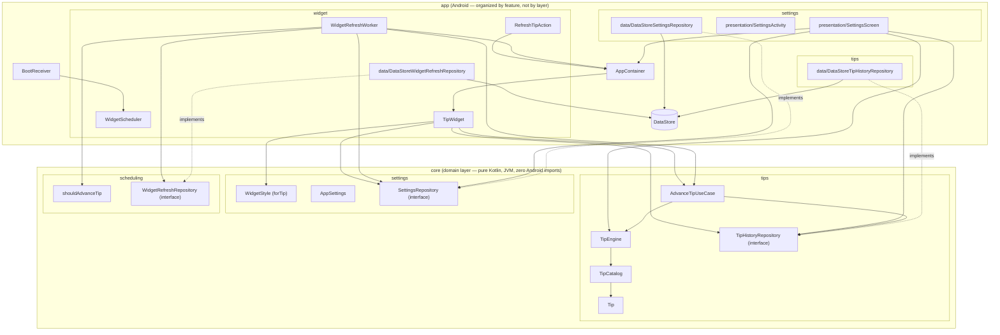

# HealthWidget


> The name is settled: **HealthWidget**, everywhere — `app_name` in `strings.xml`,
> `applicationId` (`com.healthwidget.app`), the repo name. Nothing left to decide here.

A privacy-first Android wellness app for students and desk workers: no accounts, no
tracking, no dashboards, no streaks, no notifications. Just a home-screen widget with one
rotating, [evidence-backed](TIP_SOURCES.md) tip.

## The privacy promise

**100% offline. Zero data collected.** No server, no analytics SDK, no crash reporter, no ad
SDK, and the manifest doesn't declare the `INTERNET` permission — a compromised dependency
couldn't phone home even if it tried. Tip history lives in on-device DataStore and is
included in Android's own encrypted device backup like any other app's local data — see
[PRIVACY.md](PRIVACY.md)'s "Backups" section for what that does and doesn't mean.

## v1 scope

v1 is intentionally passive — no notifications of any kind:

- A Glance home-screen widget showing the current tip. Tapping the tip card itself pulls a
  new one on the spot; a small gear icon opens the settings screen (AppWidgets can't
  intercept long-press, so a dedicated tap target is the only reliable way in).
- The tip advances on its own after it's actually had a chance to be seen — roughly every 90
  minutes of confirmed screen-on time since it was last shown, not a pure wall-clock timer
  that could rotate a tip nobody ever looked at (see "Notable design decisions" below).
- The widget's background is one of four styles (Forest, Ocean, Sunset, Midnight),
  deterministically derived from the currently-shown tip's text (`WidgetStyle.forTip`) rather
  than a user preference — a new tip means a new-looking card, not just new text. Not
  user-selectable; there's nothing to configure in Settings.
- Tips come from seven pools: four evidence-backed practical ones scoped by time of day
  (`general`/`morning`/`afternoon`/`evening`) plus three "tone" pools grouped by voice
  (`motivation`/`philosophy`/`wellbeing`). The Settings "More variety" control leans the mix
  towards tone without ever switching either group off, and the time of day decides *which*
  tone: motivation leads the morning, wellbeing and philosophy the evening and the small
  hours (see "Notable design decisions" below).
- A "Why this tip?" card in Settings showing where the current tip came from: every research
  source behind a practical tip (at least two), the quoted text behind a philosophy quotation,
  or nothing at all for an original motivational line — plus the tip's group and a button to
  pull a different tip on demand.
- The same tip never repeats within the last 30 shown.

Explicitly **not** in v1: accounts, streaks, gamification, history/progress views,
notifications, or any form of tracking.

## Architecture

Two Gradle modules, folders organized by feature (screaming architecture) with each
feature split into `data`/`presentation` layers that depend inward on `:core` (clean
architecture) rather than on each other's concrete classes:

- **`:core`** — the domain layer: pure Kotlin, JVM-only, zero Android imports. Grouped by
  concept, not by class kind:
  - `tips/` — `Tip` (text, a `TipKind`, and a `List<TipSource>` of citations — at least
    `Tip.MIN_SOURCES` of them for `TipKind.PRACTICAL`, none required for the tone kinds, see
    `TipCatalogTest`), `TipKind`, `TipEngine`, `TipCatalog`, `TipHistoryRepository`
    (interface), and `AdvanceTipUseCase`, the one "pick + persist the next tip" rule shared
    by every call site (the periodic tick worker, the widget's own tap-to-refresh, and the
    settings screen's manual refresh), so they can't silently diverge on anti-repeat (FR5).
    `TipHistoryRepository` tracks the last `MAX_RECENT_TIPS` (90) tips shown (by text) rather
    than just the single previous one. `TipEngine` excludes the most recent
    `ANTI_REPEAT_WINDOW` (30) of those outright — the FR5 guarantee — and weighs the rest by
    how long ago they were shown; the two constants are deliberately separate, see "Notable
    design decisions". `ToneProfile` holds the per-day-part tone mix.
    `TipEngine.findByText` resolves a persisted tip's text back to its full `Tip`
    (citation included) for the settings screen to display.
  - `settings/` — `WidgetStyle` (the four background styles, `WidgetStyle.forTip`'s pure
    hash-based mapping from a tip's text to one of them — not user-configurable, not backed by
    a repository) alongside `AppSettings`/`SettingsRepository`, which *is* a real persisted
    preference again: a `VarietyLevel` (`PRACTICAL`/`BALANCED`/`PLAYFUL`), read by `TipEngine`'s
    weighting (see "Notable design decisions" below).
  - `scheduling/` — `TipRefreshSchedule` (`shouldAdvanceTip`, the tick-threshold math behind
    the ~90-minutes-of-screen-on-time tip advance) and `WidgetRefreshRepository` (interface),
    the persisted screen-on tick counter (see "Notable design decisions" below).
  Everything here is trivially unit-testable and reusable as-is by a future iOS port.
- **`:app`** — the Android application, organized by feature rather than by technical
  layer (`settings/`, `tips/`, `widget/`, `boot/`). `settings/`, `tips/`, and `widget/` each
  have a `data/` sub-package with the DataStore-backed implementation of the matching
  `:core` interface (`DataStoreSettingsRepository`, `DataStoreTipHistoryRepository`,
  `DataStoreWidgetRefreshRepository`) — dependents (workers, `AppContainer`, the settings
  screen) hold the `:core` interface type, never the concrete DataStore class, per the
  Dependency Inversion Principle.



Notable design decisions:

- **The tip only advances after it's actually had a chance to be seen.** A pure wall-clock
  timer could rotate a tip nobody ever saw (screen off overnight, phone face-down all
  afternoon), so `WidgetRefreshWorker` instead ticks every `TICK_INTERVAL_MINUTES` (15,
  WorkManager's own minimum periodic interval — there's no "notify me when the screen turns
  on" primitive, and a real screen-on/off listener can't survive process death without a
  foreground service) and only counts a tick if `PowerManager.isInteractive` is true at that
  instant. `shouldAdvanceTip` (`:core`, `TipRefreshSchedule.kt`) advances the tip once
  `TICKS_UNTIL_ADVANCE` (6) such ticks — ~90 minutes of confirmed on-screen time, accumulated
  across ticks rather than requiring one unbroken session — have collected since it was last
  shown. This is a sampling approximation, not a precise stopwatch (a tick only reflects the
  instant it fired), but it's simple, needs no extra permissions or a live receiver, and the
  count is persisted (`WidgetRefreshRepository`/`DataStoreWidgetRefreshRepository`), not held
  in memory, so it survives the process dying between ticks. See `TipRefreshScheduleTest`.
- **Concurrency-safe tip advancement**: `AdvanceTipUseCase` (`:core`) wraps its
  read-history/select-tip/persist-tip sequence in a `kotlinx.coroutines.sync.Mutex`, so
  concurrent callers (the periodic tick worker, the widget's own tap-to-refresh, a manual
  refresh from Settings) can't both read the same stale history and pick the same tip. The
  mutex lives on the single `AdvanceTipUseCase` instance `AppContainer` hands out (a `by
  lazy` singleton, already required for the anti-repeat rule to hold across callers), so
  every caller shares the same lock without each construction creating a new one. See
  `AdvanceTipUseCaseTest`'s concurrent-advances test, which launches N concurrent advances
  against an N-tip pool and asserts all N tips come out distinct — a real (if narrow) race in
  the old unsynchronized version.
- **Reactive widget rendering**: the widget observes the persisted tip from *inside*
  `provideContent` (`recentTips` → `collectAsState`) rather than reading it into a local in
  `provideGlance`. This is what actually makes the tip repaint. `provideGlance` runs once per
  Glance *session*, not once per `updateAll()`, so a tip captured above `provideContent` stays
  frozen for the session's entire lifetime: `updateAll()` only refreshes `AppWidgetSession`'s
  own `glanceState`/`options` holders, so a composition reading neither never recomposes and
  never emits new RemoteViews. That was the real cause of "the tip data updates but the widget
  doesn't repaint" — confirmed on-device with the widget stuck three tips behind DataStore
  while its `RemoteViews` instance never changed across a 15-minute window.
- **Concurrency-safe widget rendering**: pushing the widget's UI (`GlanceAppWidget.updateAll()`)
  is a separate step from picking the tip, and three independent triggers (the periodic tick
  worker, the manual "get a different tip" button, tapping the widget itself) can call it with
  no ordering guarantee between them.
  `AppContainer.refreshWidget()` wraps the push in its own `Mutex`, serializing every trigger
  through one call site. Each call still re-reads the current tip from DataStore at execution
  time rather than capturing a snapshot up front, so serializing just matters for the push
  itself: whichever call runs last always renders whatever is actually persisted, regardless
  of which trigger queued first.
- **A manual tip request always visibly changes something.** `TipEngine.messageFor`'s fixed,
  single-message sleep-hours tips (23:00-05:59) are exempt from anti-repeat by design for the
  passive scheduled rotation — there's only one possible message for each, so there's nothing
  to rotate. But that made an explicit tap-to-refresh (or the Settings refresh button) during
  those ~7 hours a silent no-op: the same fixed message came back every time with no visible
  change. `messageFor`/`AdvanceTipUseCase.invoke` now take a `manual` flag; when `true`, the
  sleep-hours day parts draw from the general pool instead of the fixed message, so an
  explicit request always changes the tip (and, since the background now follows the tip,
  the background too) regardless of time of day. The passive worker-driven rotation is
  untouched (`manual` defaults to `false`), so the wind-down message still shows normally
  when nobody asked for anything.
- **A tip's `TipKind` decides how it may be presented, so the citation model doesn't have to
  lie.** The catalog started as nothing but evidence-backed wellness advice, so every tip was
  required to carry 2+ research citations. That bar is right for "mild dehydration dents focus"
  and nonsense for "you're allowed to begin again": there is no study behind encouragement, and
  inventing one, or stretching a real paper to cover it, is exactly the dishonesty the citation
  requirement exists to prevent. So the requirement is per-kind (`TipKind.requiresCitation`),
  not global, and the Settings card reads `Tip.kind` to decide what to render underneath a tip:
  "Backed by N sources" for `PRACTICAL`, "Quoted from" for an attributed `PHILOSOPHY`
  quotation, and nothing at all for an original `MOTIVATION`/`WELLBEING` line. `TipCatalogTest`
  enforces each rule separately, including that a tone tip never carries research citations.
- **Tone pools keep their attribution inline; practical pools keep the two-file layout.** A
  practical pool's tips *all* have 2-3 sources, so a companion `*_sources.txt` keeps the tip
  text readable. A tone pool's tips *mostly* have none, so a companion file would be almost
  entirely blank — and since the loader strips blank lines, the two files would silently stop
  lining up, which is a genuinely nasty failure mode. Tone pools therefore put any attribution
  on the tip's own line (`Text<TAB>Label<TAB>URL`). The asymmetry is deliberate, not drift.
- **Quotations are only used where the attribution is checkable.** Popular philosophy quotes are
  misattributed constantly (the "journey of a thousand miles" line gets pinned on Confucius;
  several famous Marcus Aurelius one-liners are modern paraphrases with no matching passage), so
  `philosophy.txt` only quotes lines traceable to a specific chapter or letter in a
  public-domain edition, and cites that edition. Everything else in the pool is original
  reflection carrying no source and claiming none.
- **Selection is three narrowing weighted choices, and anti-repeat is applied before all of
  them.** `TipEngine` picks a *tier* (practical vs. tone), then a *group* within it (`general`
  vs. this hour's pool; motivation vs. philosophy vs. wellbeing), then a tip. The order is the
  load-bearing part: every group is filtered against the anti-repeat window *first*, then
  anything with nothing fresh left is dropped and its share redistributed among the survivors,
  and only then does any weighted draw happen. Weighting first and filtering second was a real
  bug — the draw could land on a group whose only unseen tips had just been shown and repeat one
  of those while another group still had fresh options sitting unused. The original fix was a
  hand-written empty check for each of the two groups that existed at the time; with five groups
  there are simply more places for it to come back, so it is now structural (`availableTiers`)
  rather than a special case per group, and covered at both tier and group level in
  `TipEngineTest`. Only once *nothing* anywhere is unseen does selection fall back to the
  unfiltered pools, which necessarily repeats something.
- **The "more variety" setting is a lean, never a filter.** `VarietyLevel` sets the tone tier's
  share of a draw (`PRACTICAL` 20% / `BALANCED` 50% / `PLAYFUL` 80%) rather than switching either
  tier on or off — even `PRACTICAL` lets a motivation/philosophy/wellbeing tip through
  occasionally, even `PLAYFUL` leaves room for a practical one, so every level reads as "mostly
  this" rather than "only this." It deliberately stays a three-way choice even though there are
  now four kinds of tip to distribute across: per-group weights would be three more controls for
  a judgement the user has no basis to make ("how much Stoicism, exactly?"), on a settings screen
  that is one card, in an app whose whole philosophy is minimal settings. The finer distribution
  is made by the defaults instead, below.
- **Which tone suits the hour is an editorial judgement, not a setting.** The three tone pools
  used to be concatenated and weighed as one blob, so a tone draw was equally likely to be a
  motivational push, a Stoic quotation, or a quiet wellbeing invitation regardless of the time —
  and "Stop researching it. Go and do it badly." at 23:40 doesn't read as variety, it reads as
  the app not knowing what time it is. `ToneProfile.forDayPart` now splits the tone share by day
  part: motivation leads the morning and fades across the day, wellbeing and philosophy do the
  reverse. The sleep-hours profile zeroes motivation outright, which is the one place this table
  filters rather than leans — "Two minutes. Set a timer. Go." at 3am is not a weaker version of
  good advice, it's the opposite of what the hour calls for. That doesn't contradict the rule
  above, which is a promise about what the *user's setting* can do; no `VarietyLevel` ever
  silences a group. `ToneProfileTest` pins it so a later tuning pass can't soften it by accident.
- **Night is no longer the one unpersonalized corner of the app.** 23:00-05:59 used to show a
  single fixed wind-down message every time, for ~7 hours. It now runs through the same machinery
  as every other day part, with the fixed message as a one-tip practical group (still exempt from
  anti-repeat — there is nothing to rotate, and excluding it after one showing would delete the
  wind-down nudge for the rest of the night) weighed against philosophy and wellbeing. Night uses
  a much higher tone share than daytime at every level (50/70/85 rather than 20/50/80), because
  its practical side isn't a pool: at the daytime split the user would see the *identical*
  sentence four nights in five. At the default level the wind-down message is still the single
  most likely thing to see at 2am (~50% of draws), just no longer the only thing. Growing the
  sleep messages into real cited pools is still open — that's content work at the
  TIP_SOURCES.md evidence bar, not selection work.
- **`general` and the day-part pool split the practical tier evenly, rather than by pool size.**
  The two used to be concatenated and drawn from uniformly, which let file sizes set the ratio:
  `general` is roughly twice the size of any single day-part pool, so about two thirds of
  practical draws came from the most time-neutral content in the catalog and the tips actually
  *about* right now were the minority every hour of the day. Nothing intended that, and it would
  have drifted again with every content pass. The split is now a stated constant.
- **Recency weighting, not a shuffled bag.** Within a group, tips are weighted by how long it's
  been since they were shown, rising from just-out-of-the-window to the far edge of what history
  remembers; a tip never shown at all counts as maximally overdue. Uniform random is
  maximum-entropy *per draw*, but says nothing about the gaps *between* draws — a tip could leave
  the anti-repeat window and come straight back on the very next pick while another went months
  unseen, and it's the early returns a user notices as "I keep seeing the same ones." Simulated
  over 40k draws against the real catalog, this halves them: returns landing within 15 draws of a
  tip becoming eligible again drop from 28.4% to 13.1%, and the worst-case gap between showings
  of one tip falls from 831 draws to 640. Long-run *usage* evenness barely moves, because uniform
  random was already even in aggregate — the clustering was always in the gaps, not the totals.
  A shuffled bag (deal the pool in a random permutation, reshuffle when exhausted) was the other
  candidate and was rejected on three counts: the pool that matters is composed (`general` +
  whichever day-part pool) and changes four times a day, so a deck over it gets abandoned
  mid-deal; a deck per source pool then needs its own inter-deck weighting, which is the same
  problem again; and it fights the anti-repeat window, since a card that comes up while still
  inside the window has to be skipped, breaking the "every tip exactly once per cycle" guarantee
  that was the whole reason to reach for a bag. It would also have needed new persisted state,
  where weighting reuses the history that is already stored.
- **How much history is remembered and how far the no-repeat rule reaches are two numbers.**
  `TipHistoryRepository.ANTI_REPEAT_WINDOW` (30) is the product guarantee (FR5);
  `MAX_RECENT_TIPS` (90) is how much is stored. They used to be one constant, which made recency
  weighting impossible in principle rather than merely unimplemented: everything inside the
  window is hard-excluded, so a history exactly as long as the window carries no usable signal at
  all — every eligible tip looks equally unseen and selection can do no better than uniform.
  Keeping them separate also means growing the memory to improve how varied selection *feels* can
  never quietly widen or narrow the guarantee itself, which `TipEngineTest` checks in both
  directions. The cost is 60 more tip texts in local storage; see [PRIVACY.md](PRIVACY.md).
- The Glance widget's `updatePeriodMillis` is set to `0`; refresh is driven entirely by
  `WidgetScheduler`'s own 15-minute WorkManager periodic job (see the tip-advance tick model
  above), since the AppWidget framework's own update period has an unreliable 30-minute floor.
- Tip content lives in bundled plain-text resources (`core/src/main/resources/tips/*.txt`
  plus a line-for-line `*_sources.txt` citation file per pool), not a JSON asset, to avoid
  pulling a JSON dependency into a module whose whole point is to stay dependency-free.
  Every non-obvious claim a tip makes is cited in [TIP_SOURCES.md](TIP_SOURCES.md),
  organized by theme rather than by file, and enforced in code (`TipCatalog.loadDefault`,
  `TipCatalogTest`) so a tip can't ship without one.
- **Every tip carries at least two independent citations, and sources repeat across tips on
  purpose.** One citation reads as one study's opinion, which isn't much of an evidence claim
  to put on someone's home screen; two or three sources that independently agree are. A source
  line in `*_sources.txt` is therefore one or more `Label<TAB>URL` pairs tab-separated end to
  end (an even field count), preserving the one-line-per-tip correspondence, and `Tip.sources`
  is a `List<TipSource>`. `TipCatalogTest` enforces the `Tip.MIN_SOURCES` floor, HTTPS URLs,
  and that a tip's own sources are distinct from each other — citing the same URL twice would
  otherwise satisfy the count without adding evidence. The same meta-analysis legitimately
  backing a dozen sitting-related tips is expected and fine. Source-quality rules (primary
  study over press release; no Wikipedia/ResearchGate/aggregator pages; consumer health sites
  only alongside a peer-reviewed primary) are written up in TIP_SOURCES.md, along with the four
  claims a source-by-source audit found were wrong, overstated, or contradicted by the very
  study they cited.
- There's no DI framework (`AppContainer` is a hand-written composition root) and no
  ViewModel (the settings screen collects `Flow`s directly) — both are deliberately skipped
  as unnecessary weight for an app this size, not oversights.
- The widget's background is one of four real `<layer-list>` drawable resources, selected by
  `WidgetStyle.forTip` (`Math.floorMod(tipText.hashCode(), 4)`) rather than a stored
  preference — the same tip text always renders the same style, and there's no Settings UI
  for it any more since there's nothing left to choose.
- **Backup policy**: the app opts in to Android's built-in backup system and explicitly
  includes settings + tip history in both `backup_rules.xml` (legacy, API < 31) and
  `data_extraction_rules.xml` (API 31+) — chosen over excluding this data, since it's the
  option consistent with the project's existing "your local settings/history, backed up
  like any other app's" framing, and it's all non-sensitive. Both files previously pointed
  at `domain="sharedpref"`, which matched nothing (the app has no `SharedPreferences` at
  all — settings and tip history are Preferences DataStore, stored under `files/datastore/`,
  not `shared_prefs/`), so backup coverage looked configured but silently did nothing; both
  now correctly use `domain="file" path="datastore/"`. See [PRIVACY.md](PRIVACY.md)'s
  "Backups" section for what this does and doesn't mean for the user — notably, this is the
  one case where locally-stored data can leave the device (via Android's own backup
  service), which the policy is written to state plainly rather than gloss over.

## Tech stack

Kotlin · Jetpack Compose (Material 3) · Glance · WorkManager · DataStore (Preferences) ·
Gradle Kotlin DSL with a version catalog (AGP 8.10.1, Gradle 8.11.1). `minSdk 26`,
`compileSdk`/`targetSdk 36`.

## Building

Requires JDK 17.

```bash
./gradlew build
```

## Testing

```bash
./gradlew test        # unit tests (TipEngine has full branch coverage — see core/src/test)
./gradlew ktlintCheck # formatting
./gradlew lint        # Android lint
```

CI (`.github/workflows/ci.yml`) runs all three plus a full build on every push and PR.

## Roadmap

- [x] A motivational/philosophical quote pool, aimed specifically at lowering stress and
      lifting mood — a new tone alongside the practical wellness tips, not a replacement for
      them. Landed as **three** pools rather than one, grouped by voice: `motivation.txt` (43),
      `philosophy.txt` (36, twenty-eight of them attributed public-domain quotations),
      `wellbeing.txt` (45). Each file carries its writing rules as header comments — its voice,
      how to keep it varied, and how far its humour may go — and `TipCatalogTest` guards the one
      that's checkable (philosophy stays majority-quotation). Selection now treats the three as
      genuinely different things rather than one blob — see the tone-algorithm item below.
- [x] Introduce a `TipKind` so non-evidence content is presented honestly instead of being
      forced through a citation model that only fits evidence-backed health tips. Done as part
      of writing the content, as planned: `TipKind` is `PRACTICAL`/`MOTIVATION`/`PHILOSOPHY`/
      `WELLBEING`, and `requiresCitation` is true only for `PRACTICAL`. The
      "quotation vs. reflection" distinction the original note wanted turned out not to need
      its own kind: within `PHILOSOPHY`, a quotation carries exactly one source (the
      public-domain text it came from) and a reflection carries none, which the UI already
      renders differently ("Quoted from" vs. nothing).
- [x] Lighter, more openly humorous content. The three tone pools that landed are warm but
      earnest; none of them was actually *funny*, and the `PLAYFUL` variety level arguably
      promised a lightness the content didn't deliver. Done as a pure content change, as
      predicted: no structural work, no new `TipKind`, no new pool. `wellbeing.txt` gained a
      **Lighter** group (8 lines) and `motivation.txt` a **Wry** group (5 lines that still
      push). Each file carries a new header rule for its group, because the "grating on a bad
      day" risk is real and specific: humour that needs the reader to be having a bad day to
      land, or that is at the reader's expense, breaks the rules those pools already had.
- [ ] Sleep-hours messages (`sleepLate`/`sleepEarlyHours`) are still one fixed `Tip` each,
      deliberately exempt from anti-repeat. **Mostly addressed** by the tone-algorithm work
      below, from the other direction than this note assumed: rather than growing the practical
      wind-down content, night now runs through the same selection machinery as every other day
      part, with the fixed message weighed against the philosophy and wellbeing pools and
      motivation excluded entirely. Night is no longer the unpersonalized corner — at the
      default level the fixed message is ~50% of night draws rather than 100%. What's still open
      is the original literal ask: turning the two messages into real *practical* pools. That's
      content work at the TIP_SOURCES.md evidence bar (each new tip needs two independent
      primary citations), deliberately kept separate from the selection change so the two don't
      get entangled.
- [x] More tips in the existing pools (general/morning/afternoon/evening). The near-duplicate
      pass below replaced repeats rather than growing the pools, leaving them flat at
      41/23/22/23. Now **45/24/24/26** (109 practical tips to 119), chosen to fill topic gaps
      rather than restate covered ground: time outdoors, social connection, acts of kindness
      and dietary fibre (general); muscle-strengthening (morning); short vigorous bursts and
      music for stress (afternoon); evening exercise timing, night mode vs screen brightness,
      and short sleep vs colds (evening). Every one carries two independent citations verified
      against the primary literature, written up in [TIP_SOURCES.md](TIP_SOURCES.md).
- [ ] More background styles beyond the current four (Forest/Ocean/Sunset/Midnight).
- [x] Remove em dashes from all app-facing text. Done for bundled tip content and enforced by
      `TipCatalogTest`'s "no tip text contains an em dash" case so it can't regress;
      `strings.xml` already had none. Docs still use them, deliberately — they're prose for
      maintainers, not app-facing text.
- [x] Audit the tip pools for near-duplicates — tips that gave essentially the same advice in
      different words, which `TipCatalogTest`'s exact-text-duplicate check never caught. Roughly
      a third of the catalog was rewritten: verbatim-ish pairs were removed outright (two
      "outdoor light is brighter than indoors" morning tips, two "a short chat lifts the
      afternoon" tips), and the remaining clusters were differentiated by *register* rather than
      merged, so an action tip and the evidence tip behind it now say different things (e.g.
      "jot down tomorrow's top task" and the nine-minutes-faster sleep-lab finding; five
      overlapping "take a break" tips now cover the walk, the eye rest, the mechanism, the
      quiet minute, and when to break).
- [x] **Rework how a tip is chosen, now that the tone pools exist.** Done, from the brief in
      [docs/TONE_ALGORITHM_PROMPT.md](docs/TONE_ALGORITHM_PROMPT.md). Selection is now three
      narrowing weighted choices (tier, then group, then tip) with anti-repeat applied to every
      group before any of them; the three tone pools are split by time of day
      (`ToneProfile`) instead of concatenated into one blob; `general` and the day-part pool
      split the practical share evenly instead of by file size; and uniform random within a pool
      became recency weighting over a 90-tip history, which halves the early returns that made
      rotation feel repetitive. A shuffled bag was considered and rejected; `VarietyLevel`
      deliberately stayed a three-way choice rather than gaining per-group weights. Full
      rationale for each, including what was rejected and why, is in "Notable design decisions"
      above.
- [ ] **Confirm what actually makes tapping for a new tip feel laggy.** Still open, and still
      unconfirmed — but the tip-selection algorithm is now ruled out by measurement rather than
      by argument: against the real catalog on a desktop JVM, `messageFor` costs ~7µs per draw
      while `TipCatalog.loadDefault()` costs ~3-5ms, i.e. the selection path is well under 1% of
      just parsing the catalog, and neither is a multi-second lag on its own. The remaining
      suspect is unchanged: `TipEngine`'s default constructor calls `TipCatalog.loadDefault()`,
      which parses all 12 bundled `tips/*.txt`/`*_sources.txt` resource files from scratch.
      `AppContainer` only pays that once per living process (`tipEngine` is a `by lazy`
      singleton), but if the process is being killed and cold-started between taps (plausible
      for a backgrounded widget-only app with no persistent foreground presence), every tap
      pays it again on ART — plausibly 10-20× the desktop JVM figure — plus Glance's own
      composition-startup cost, which together would produce this symptom. Needs real on-device
      timing/logcat evidence before anything is treated as the fix; a desktop JVM number is a
      bound, not a measurement of the thing users are feeling.
- [ ] Widget size variants (small/medium) via Glance's responsive sizing.
- [ ] Localization beyond `en` (all strings are already externalized to `strings.xml`).
- [ ] Low priority, no urgency either way:
      - Reconsider the "More variety" section title now that it's a three-way `VarietyLevel`
        picker (Practical/Balanced/Playful) rather than an on/off toggle — the original naming
        concern was about a binary switch reading as "only this," which the three labeled
        levels plus the state description under them already resolve most of. Bikeshed, not a
        fix.
      - Tighten the iOS-port claim below ("plain enough to port directly" slightly overstates
        it) — `TipCatalog.loadDefault()` uses `Class.getResourceAsStream`, a real JVM-only API,
        so a Kotlin Multiplatform port would need an expect/actual around resource loading at
        minimum, not just a recompile.
- [ ] **iOS port** via WidgetKit + App Intents, sharing the same tip-selection rules (the
      `:core` module's logic is plain enough to port directly).

## License

[MIT](LICENSE).
