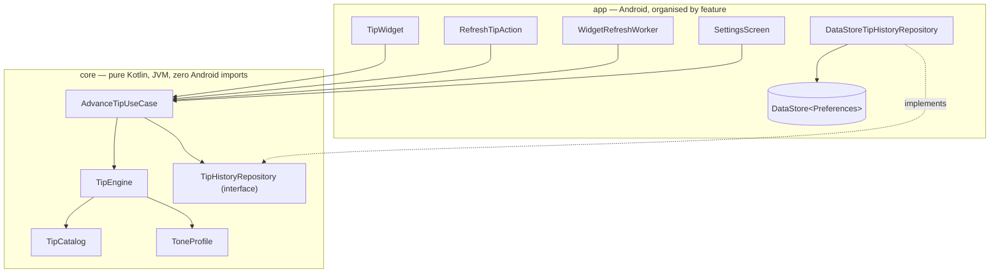

# SapGlance


A privacy-first Android wellness widget for students and desk workers. One card on the home
screen showing one rotating tip — practical advice with real citations, or a line of
motivation, philosophy or wellbeing. No accounts, no tracking, no streaks, no notifications.

> The repo was renamed from `health-widget` to `SapGlance` to match the app. GitHub redirects
> the old URL, so existing clones keep working, but `git remote set-url origin` is worth running
> on any checkout that still points at the old name.

## The privacy promise

**100% offline. Zero data collected.** No server, no analytics SDK, no crash reporter, no ad
SDK — and the manifest doesn't declare the `INTERNET` permission, so a compromised dependency
couldn't phone home even if it tried. That's a structural guarantee rather than a policy one.

Tip history lives in on-device DataStore and rides along in Android's own encrypted device
backup like any other app's local data. That's the one path data can leave the phone, and
[PRIVACY.md](PRIVACY.md)'s "Backups" section states it plainly rather than glossing over it.

## What it does

- **A Glance home-screen widget** showing the current tip. Tapping the card pulls a new tip on
  the spot; a small gear icon opens settings. (AppWidgets can't intercept long-press — the
  launcher reserves that gesture — so a dedicated tap target is the only reliable way in.)
- **The tip advances once it's had a chance to be seen** — roughly every 90 minutes of
  confirmed screen-on time, not a wall-clock timer that could rotate a tip nobody looked at.
- **The card's background is one of eleven styles**, derived from the current tip's text rather
  than from a setting, so a new tip means a new-looking card. Seven dark (Forest, Ocean,
  Sunset, Midnight, Aurora, Dawn, Rain) and four light (Winter, Paper, Meadow, Blossom). The
  whole ink set — text, scrim, frame, gear — flips with the style rather than following the
  phone's day/night theme, because what the text contrasts against is the artwork behind it.
- **The widget resizes** from a 2x2 square to a 4x4 block, with a layout built for each end of
  that range rather than one layout stretched across it.
- **282 tips in seven pools**: four practical ones scoped by time of day (`general` 50,
  `morning` 26, `afternoon` 26, `evening` 28, plus one fixed wind-down message for each of the
  two sleep windows) and three tone pools grouped by voice (`motivation` 53, `philosophy` 42,
  `wellbeing` 55).
- **A "Why this tip?" card in settings** showing where the current tip came from: the research
  behind a practical tip, the text behind a philosophy quotation, or nothing at all for an
  original line.
- **The same tip never repeats within the last 100 shown**, and no tone voice appears three
  draws in a row.

Explicitly **not** here: accounts, streaks, gamification, history views, notifications, or any
form of tracking.

## Architecture

Two Gradle modules. Folders are organised by feature, with each feature split into
`data`/`presentation` layers that depend inward on `:core` rather than on each other.

- **`:core`** — the domain layer: pure Kotlin, JVM-only, zero Android imports.
  - `tips/` — `Tip`, `TipKind`, `TipCatalog`, `TipEngine`, `ToneProfile`,
    `TipHistoryRepository` (interface), and `AdvanceTipUseCase`, the single "pick + persist the
    next tip" rule shared by every caller so they can't diverge on anti-repeat.
  - `settings/` — `AppSettings` / `SettingsRepository`, holding the one real preference: a
    `VarietyLevel` of `PRACTICAL` / `BALANCED` / `PLAYFUL`.
  - `widget/` — `WidgetStyle` and its pure hash-based `forTip` mapping. It lived under
    `settings/` once, which was wrong in a way worth naming: it is explicitly *not* a setting,
    so the package said the opposite of what the type's own docs said.
  - `scheduling/` — `TipRefreshSchedule` (the tick-threshold math) and `WidgetRefreshRepository`
    (interface).
- **`:app`** — the Android application, organised by feature (`settings/`, `tips/`, `widget/`,
  `boot/`). Each feature's `data/` holds the DataStore implementation of the matching `:core`
  interface; dependents hold the interface type, never the concrete class.

Two placements are deliberate:

- **`TipWidgetReceiver` stays at the `widget/` root.** Its fully-qualified name is the
  `ComponentName` the launcher persists for every placed widget, so renaming it drops every
  widget off the home screen on the next install.
- **The Compose theme lives under `settings/presentation/theme/`.** It has one caller; the
  widget uses Glance's own `GlanceTheme`.

The shape that matters is the dependency inversion: every writer of a tip goes through one use
case, and `:core` owns the interfaces that `:app` implements.



`SettingsRepository` and `WidgetRefreshRepository` follow the same interface-in-`:core`,
DataStore-implementation-in-`:app` pattern.

## How a tip is chosen

Three narrowing weighted choices: a **tier** (practical vs. tone), then a **group** within it
(`general` vs. this hour's pool; motivation vs. philosophy vs. wellbeing), then a **tip**.

The order is load-bearing. Every group is filtered against the anti-repeat window *first*, then
anything with nothing fresh left is dropped and its share redistributed among the survivors,
and only then does any weighted draw happen. Weighting first and filtering second was a real
bug: the draw could land on a group whose only unseen tips had just been shown and repeat one
of those while another group had fresh options sitting unused.

## Notable design decisions

- **The tip advances only after it's had a chance to be seen.** `WidgetRefreshWorker` ticks every
  15 minutes (WorkManager's minimum), counts a tick only if the screen is interactive, and
  advances at 6. A real screen-state listener can't survive process death without a foreground
  service, which is what this app refuses to be.
- **The widget observes its tip from inside `provideContent`.** `provideGlance` runs once per
  Glance *session*, not per `updateAll()`, so a tip read into a local above it stays frozen for
  the session's life and the widget never repaints. This was a real bug, found on-device with
  the widget stuck three tips behind DataStore.
- **A tip's `TipKind` decides how it may be presented.** 2+ citations is the right bar for "mild
  dehydration dents focus" and nonsense for "you're allowed to begin again" — there is no study
  behind encouragement, and inventing one is the dishonesty the citation model exists to prevent.
  So the requirement is per-kind, and the UI shows sources, an attribution, or nothing.
- **Every practical tip carries two independent citations.** One reads as one study's opinion.
  `TipCatalogTest` enforces the floor, HTTPS, and that a tip's own sources are distinct.
- **Quotations are only used where the attribution is checkable** — traceable to a chapter or
  letter in a named public-domain edition, because popular philosophy quotes are misattributed
  constantly.
- **Variety is a lean, never a filter.** `VarietyLevel` sets the tone tier's share (20/50/80%)
  rather than switching a tier off. It stays three choices rather than per-group weights, which
  would ask the user a question they have no basis to answer ("how much Stoicism, exactly?").
- **Which tone suits the hour is editorial, not a setting.** Motivation leads the morning and
  fades; wellbeing and philosophy do the reverse. Night zeroes motivation — "Two minutes. Set a
  timer. Go." at 3am is the opposite of what the hour calls for.
- **No tone voice runs three draws in a row.** Anti-repeat covers *tips*, not *kinds*, and three
  different wellbeing lines still reads as a rut. The blocked group's share flows to the other
  voices, so the rule changes *which* tone comes next, never how much. `PRACTICAL` is exempt: it
  is the default register, not a voice.
- **Recency weighting, not a shuffled bag.** Uniform random is maximum-entropy per draw but says
  nothing about the gaps *between* draws, and early returns are what read as repetitive. A
  shuffled bag was rejected: the pool is composed and changes four times a day, so a deck over it
  gets abandoned mid-deal, and it fights the anti-repeat window.
- **The anti-repeat window and the stored history are two numbers.** `ANTI_REPEAT_WINDOW` (100)
  is the guarantee; `MAX_RECENT_TIPS` (160) is what's remembered. One constant made recency
  weighting impossible in principle — everything inside the window is hard-excluded, so a history
  as long as the window carries no signal. The 60 between them is what the weighting scales by.
- **The window is capped by the narrowest reachable pool, not the catalog total.** A
  single-day-part user reaches only `general` plus one pool (76-78 tips) for practical draws, and
  ~80% of draws want that set at the practical level. It holds because an exhausted tier
  redistributes into tone instead of repeating. `TipCatalogTest` runs the real catalog for 2000
  draws per day part, so over-raising this fails a test rather than shipping.
- **The widget's layout derives from its size, never from the text.** Width sets the font size,
  height sets how much decoration survives. An earlier attempt measured each *tip* with
  `StaticLayout`, and that prediction disagreed with the real `TextView` across launchers — too
  large for long tips, one word per line for short ones.
- **Chrome is charged before the type is sized**, so every decorative dp comes out of the font.
  That is why the quote glyph needs a tall card to appear at all, and why padding isn't spent
  twice over.
- **The typeface and its width calibration are one value, not two.** `TipFace` pairs the font with
  the character-width figure measured for *that* font. They were separate constants once and
  drifted apart immediately — the face changed and the figure, measured against the old one,
  stayed put, so the card sized type for a font it no longer used and gave back a third of its
  height. Nothing failed loudly, because a stale figure over-reserves rather than clipping, which
  is exactly what made it survive. The figure is derived from the font file's `hmtx` advance times
  a wrap-waste factor, then checked against a real render.
- **No DI framework and no ViewModel.** `AppContainer` is a hand-written composition root; the
  settings screen collects `Flow`s directly.
- **Tip content is bundled plain text**, not JSON, to keep `:core` dependency-free. Practical
  pools use a line-for-line `*_sources.txt`; tone pools keep attribution inline, because a
  mostly-blank companion file would silently stop lining up once blank lines were stripped.

## Tech stack

Kotlin · Jetpack Compose (Material 3) · Glance · WorkManager · DataStore (Preferences) ·
Gradle Kotlin DSL with a version catalog (AGP 8.10.1, Gradle 8.11.1). `minSdk 26`,
`compileSdk`/`targetSdk 36`.

## Building and testing

Requires JDK 17.

```bash
./gradlew build        # everything, including assembleRelease
./gradlew test         # unit tests — :core 80, :app 6 per variant
./gradlew ktlintCheck  # formatting
./gradlew lint         # Android lint
```

CI (`.github/workflows/ci.yml`) runs all of it on every push and PR.

## Roadmap

Completed work lives in the git history rather than here. What's open:

- [ ] **Sleep-hours pools.** `sleepLate`/`sleepEarlyHours` are still one fixed message each.
      Night no longer *depends* on them — it runs through the same machinery as every other day
      part, with the fixed message weighed against philosophy and wellbeing — but turning them
      into real practical pools is still content work at the TIP_SOURCES.md evidence bar.
- [ ] **The tone pools need a content pass.** Philosophy is conventional rather than serious,
      and motivation has drifted into wellbeing's register despite its own header forbidding
      exactly that. See STATUS.md for the full write-up; this is the highest-value content work
      outstanding.
- [ ] **A jokes pool.** A fourth tone voice, alongside motivation, philosophy and wellbeing.
      **Source them, don't write them** — collect from existing public-domain and clearly-attributed
      humour rather than composing new lines, because written-to-order jokes read as generated and
      that is precisely the failure. Needs: a licence check per source, the ~90-character cap,
      a `ToneProfile` share per day part, and a decision on whether jokes belong at night.
- [ ] **Tie the background to the tip's kind and the hour, not to a hash.** `WidgetStyle.forTip`
      currently picks from `entries` by `tipText.hashCode()`, so the pairing is arbitrary — a
      philosophy line at 2am can land on the bright Meadow card, and a morning stretch tip on
      Midnight. The 11 styles already split into a dark group (Forest, Ocean, Sunset, Midnight,
      Aurora, Dawn, Rain) and a light one (Winter, Paper, Meadow, Blossom), which is most of the
      vocabulary needed: pale cards suit morning and practical advice, deep ones suit evening,
      night and philosophy. Design notes for whoever picks this up:
      - Keep the property that a *new tip means a new-looking card* — that is why the hash exists,
        and mapping kind+day-part alone would leave the background unchanged across consecutive
        tips of the same kind in the same hour. The likely shape is to narrow to a candidate
        *set* by kind and hour, then keep hashing within it.
      - `forTip` is pure and lives in `:core`, which has no `Android` or clock access. Day part is
        `TipEngine.dayPartFor`, and kind is `TipCatalog.kindOf(text)`, so both would have to be
        passed in rather than read — matching how `TipEngine` already takes `LocalTime`.
      - The dark/light split is not recorded in `:core` at all: `:app` pairs each style with its
        drawable *and* its ink in one exhaustive `when`, deliberately, so a style cannot ship with
        mismatched text colour. Moving group membership into `:core` needs to preserve that.
- [ ] **A plain-English pass, worst in the medical/practical pools.** Some tips are genuinely hard
      to understand on a glance — awkward constructions, sentences that need re-reading. It is
      concentrated in the evidence-backed practical pools (`general`, `morning`, `afternoon`,
      `evening`) rather than the tone ones, and the cause is structural rather than careless: a
      tip that has to stay faithful to what its two citations actually support, inside ~90
      characters, drifts towards the register of the abstract it came from. "Mild dehydration
      dents focus" is a finding restated, not a thing a person says. Rewrite for the glance and
      re-check each line still matches its sources — the citation is the constraint that made it
      read this way, so it is also the thing that can silently be broken by fixing it.
      Note the collision with tip-text-as-identity: rewording orphans a user's stored history and
      changes the tip's `WidgetStyle`, so do it in one pass rather than continuously.
- [ ] **Make a cold tap *feel* faster.** ~1s of a cold tap is process start plus Glance session
      setup, not app code, and `warmUp()` already hides the catalog parse behind it. No obvious
      answer left: a widget has no cheap way to acknowledge a tap before its process exists, and
      the things that would are what this app refuses to be.
- [ ] **Languages beyond `en`.** The UI half is nearly free — every string is externalised. The
      content half is the actual project: 282 tips loaded via a classpath lookup that knows
      nothing about `Locale`, tips identified by their text everywhere it matters, and citations
      pointing at English-language sources a translated reader can't use.
- [ ] **iOS port**, gated on hardware. The headline constraint: the privacy promise doesn't
      translate literally, since no iOS app can declaratively renounce network access. Also
      WidgetKit has no background execution, so tap-to-refresh needs iOS 17+ and the rotation
      model would become wall-clock — the model this project deliberately rejected.

## License

MIT — see [LICENSE](LICENSE).
