# SapGlance


A privacy-first Android wellness widget for students and desk workers. One card on the home
screen showing one rotating tip — practical advice with real citations, or a line of
motivation, philosophy or wellbeing. No accounts, no tracking, no streaks, no notifications.

> The GitHub repo is still named `health-widget` while the app is `SapGlance`
> (`com.sapglance.app`). That's cosmetic; renaming it would break clone URLs and the CI badge
> above for no benefit.

## The privacy promise

**100% offline. Zero data collected.** No server, no analytics SDK, no crash reporter, no ad
SDK — and the manifest doesn't declare the `INTERNET` permission, so a compromised dependency
couldn't phone home even if it tried. That's a structural guarantee rather than a policy one.

Tip history lives in on-device DataStore and rides along in Android's own encrypted device
backup like any other app's local data. That's the one path data can leave the phone, and
[PRIVACY.md](PRIVACY.md)'s "Backups" section states it plainly rather than glossing over it.

## What it does

- **A Glance home-screen widget** showing the current tip. Tapping the card pulls a new tip on
  the spot; a small gear icon opens settings. (AppWidgets can't intercept long-press — the
  launcher reserves that gesture — so a dedicated tap target is the only reliable way in.)
- **The tip advances once it's had a chance to be seen** — roughly every 90 minutes of
  confirmed screen-on time, not a wall-clock timer that could rotate a tip nobody looked at.
- **The card's background is one of eleven styles**, derived from the current tip's text rather
  than from a setting, so a new tip means a new-looking card. Seven dark (Forest, Ocean,
  Sunset, Midnight, Aurora, Dawn, Rain) and four light (Winter, Paper, Meadow, Blossom). The
  whole ink set — text, chip, frame, gear — flips with the style rather than following the
  phone's day/night theme, because what the text contrasts against is the artwork behind it.
- **The widget resizes** from a 2x2 square to a 4x4 block, with a layout built for each end of
  that range rather than one layout stretched across it.
- **282 tips in seven pools**: four practical ones scoped by time of day (`general` 50,
  `morning` 26, `afternoon` 26, `evening` 28, plus one fixed wind-down message for each of the
  two sleep windows) and three tone pools grouped by voice (`motivation` 53, `philosophy` 42,
  `wellbeing` 55).
- **A "Why this tip?" card in settings** showing where the current tip came from: the research
  behind a practical tip, the text behind a philosophy quotation, or nothing at all for an
  original line.
- **The same tip never repeats within the last 30 shown**, and no tone voice appears three
  draws in a row.

Explicitly **not** here: accounts, streaks, gamification, history views, notifications, or any
form of tracking.

## Architecture

Two Gradle modules. Folders are organised by feature, with each feature split into
`data`/`presentation` layers that depend inward on `:core` rather than on each other.

- **`:core`** — the domain layer: pure Kotlin, JVM-only, zero Android imports.
  - `tips/` — `Tip`, `TipKind`, `TipCatalog`, `TipEngine`, `ToneProfile`,
    `TipHistoryRepository` (interface), and `AdvanceTipUseCase`, the single "pick + persist the
    next tip" rule shared by every caller so they can't diverge on anti-repeat.
  - `settings/` — `AppSettings` / `SettingsRepository`, holding the one real preference: a
    `VarietyLevel` of `PRACTICAL` / `BALANCED` / `PLAYFUL`.
  - `widget/` — `WidgetStyle` and its pure hash-based `forTip` mapping. It lived under
    `settings/` once, which was wrong in a way worth naming: it is explicitly *not* a setting,
    so the package said the opposite of what the type's own docs said.
  - `scheduling/` — `TipRefreshSchedule` (the tick-threshold math) and `WidgetRefreshRepository`
    (interface).
- **`:app`** — the Android application, organised by feature (`settings/`, `tips/`, `widget/`,
  `boot/`). Each feature's `data/` holds the DataStore implementation of the matching `:core`
  interface; dependents hold the interface type, never the concrete class.

Two placements are deliberate:

- **`TipWidgetReceiver` stays at the `widget/` root.** Its fully-qualified name is the
  `ComponentName` the launcher persists for every placed widget, so renaming it makes Android
  find no provider on the next install and drop every widget off the home screen. A tidier
  package isn't worth making people re-add their widgets.
- **The Compose theme lives under `settings/presentation/theme/`.** It has exactly one caller;
  the widget uses Glance's own `GlanceTheme`. A top-level `theme/` package would name a
  technical layer that only one feature uses.

```mermaid
graph TD
    subgraph core["core (domain layer — pure Kotlin, JVM, zero Android imports)"]
        subgraph coreTips["tips"]
            Tip
            TipEngine
            TipCatalog
            ToneProfile
            TipHistoryRepository["TipHistoryRepository (interface)"]
            AdvanceTipUseCase
        end
        subgraph coreSettings["settings"]
            AppSettings
            SettingsRepository["SettingsRepository (interface)"]
        end
        subgraph coreWidget["widget"]
            WidgetStyle["WidgetStyle (forTip)"]
        end
        subgraph coreScheduling["scheduling"]
            TipRefreshSchedule["shouldAdvanceTip"]
            WidgetRefreshRepository["WidgetRefreshRepository (interface)"]
        end
    end

    subgraph app["app (Android — organized by feature, not by layer)"]
        subgraph settingsFeature["settings"]
            DataStoreSettingsRepository["data/DataStoreSettingsRepository"]
            SettingsActivity["presentation/SettingsActivity"]
            SettingsScreen["presentation/SettingsScreen"]
        end
        subgraph tipsFeature["tips"]
            DataStoreTipHistoryRepository["data/DataStoreTipHistoryRepository"]
        end
        subgraph widget["widget"]
            TipWidget
            RefreshTipAction
            WidgetRefreshWorker
            WidgetScheduler
            DataStoreWidgetRefreshRepository["data/DataStoreWidgetRefreshRepository"]
        end
        AppContainer
        BootReceiver
        DataStore[("DataStore<Preferences>")]
    end

    DataStoreTipHistoryRepository -.implements.-> TipHistoryRepository
    DataStoreWidgetRefreshRepository -.implements.-> WidgetRefreshRepository
    DataStoreSettingsRepository -.implements.-> SettingsRepository
    DataStoreTipHistoryRepository --> DataStore
    DataStoreWidgetRefreshRepository --> DataStore
    DataStoreSettingsRepository --> DataStore
    TipCatalog --> Tip
    TipEngine --> TipCatalog
    TipEngine --> ToneProfile
    AdvanceTipUseCase --> TipEngine
    AdvanceTipUseCase --> TipHistoryRepository

    SettingsScreen --> TipHistoryRepository
    SettingsScreen --> TipEngine
    SettingsScreen --> SettingsRepository
    SettingsScreen --> AppContainer

    WidgetRefreshWorker --> AdvanceTipUseCase
    WidgetRefreshWorker --> TipRefreshSchedule
    WidgetRefreshWorker --> WidgetRefreshRepository
    WidgetRefreshWorker --> SettingsRepository
    WidgetRefreshWorker --> AppContainer
    RefreshTipAction --> AppContainer
    TipWidget --> AdvanceTipUseCase
    TipWidget --> TipHistoryRepository
    TipWidget --> SettingsRepository
    TipWidget --> WidgetStyle

    BootReceiver --> WidgetScheduler
```



## How a tip is chosen

Three narrowing weighted choices: a **tier** (practical vs. tone), then a **group** within it
(`general` vs. this hour's pool; motivation vs. philosophy vs. wellbeing), then a **tip**.

The order is load-bearing. Every group is filtered against the anti-repeat window *first*, then
anything with nothing fresh left is dropped and its share redistributed among the survivors,
and only then does any weighted draw happen. Weighting first and filtering second was a real
bug: the draw could land on a group whose only unseen tips had just been shown and repeat one
of those while another group had fresh options sitting unused.

## Notable design decisions

- **The tip only advances after it's had a chance to be seen.** `WidgetRefreshWorker` ticks
  every 15 minutes (WorkManager's minimum) and only counts a tick if `PowerManager.isInteractive`
  is true at that instant; the tip advances at 6 counted ticks. It's a sampling approximation,
  not a stopwatch, but it needs no extra permissions or a live receiver, and the count is
  persisted so it survives the process dying between ticks. There is no "notify me when the
  screen turns on" primitive, and a real screen-state listener can't survive process death
  without a foreground service — which is exactly what this app refuses to be.
- **The widget observes its tip from inside `provideContent`.** This is what makes it repaint
  at all. `provideGlance` runs once per Glance *session*, not once per `updateAll()`, so a tip
  read into a local above `provideContent` stays frozen for the session's whole life:
  `updateAll()` only refreshes `AppWidgetSession`'s own state holders, so a composition reading
  neither never recomposes and never emits new RemoteViews. That was the real cause of "the tip
  updates but the widget doesn't" — confirmed on-device with the widget stuck three tips behind
  DataStore.
- **A tip's `TipKind` decides how it may be presented.** The catalog began as evidence-backed
  advice only, so every tip needed 2+ citations. That bar is right for "mild dehydration dents
  focus" and nonsense for "you're allowed to begin again" — there is no study behind
  encouragement, and inventing one is exactly the dishonesty the citation model exists to
  prevent. So the requirement is per-kind, and the UI renders sources, an attribution, or
  nothing accordingly.
- **Every practical tip carries at least two independent citations.** One reads as one study's
  opinion; two or three that independently agree is an evidence claim worth putting on
  someone's home screen. `TipCatalogTest` enforces the floor, HTTPS URLs, and that a tip's own
  sources are distinct — citing one URL twice would otherwise satisfy the count without adding
  evidence.
- **Quotations are only used where the attribution is checkable.** Popular philosophy quotes
  are misattributed constantly, so `philosophy.txt` only quotes lines traceable to a specific
  chapter or letter in a public-domain edition, and cites that edition.
- **"More variety" is a lean, never a filter.** `VarietyLevel` sets the tone tier's share
  (20/50/80%) rather than switching either tier off. It stays a three-way choice rather than
  gaining per-group weights, which would be three more controls for a judgement the user has no
  basis to make ("how much Stoicism, exactly?").
- **Which tone suits the hour is editorial, not a setting.** `ToneProfile.forDayPart` splits the
  tone share by time of day: motivation leads the morning and fades, wellbeing and philosophy do
  the reverse. Night zeroes motivation outright — "Two minutes. Set a timer. Go." at 3am isn't a
  weaker version of good advice, it's the opposite of what the hour calls for.
- **No tone voice runs three draws in a row.** Anti-repeat guarantees no *tip* returns too soon
  but says nothing about *kind*, and three different wellbeing lines running still reads as a
  rut. A kind that fills two consecutive draws yields the next one. The block drops that group
  and its share flows to the other two voices, so the rule changes *which* tone comes next,
  never how much tone the user gets. `PRACTICAL` is exempt: it's the default register rather
  than a voice, and capping it would force tone in at the setting that says not to.
- **Recency weighting, not a shuffled bag.** Within a group, tips are weighted by how long since
  they were shown. Uniform random is maximum-entropy *per draw* but says nothing about the gaps
  *between* draws, and it's early returns that read as "I keep seeing the same ones." A shuffled
  bag was rejected because the pool that matters is composed and changes four times a day, so a
  deck over it gets abandoned mid-deal — and it fights the anti-repeat window.
- **The anti-repeat window and the stored history are two numbers.** `ANTI_REPEAT_WINDOW` (30)
  is the product guarantee; `MAX_RECENT_TIPS` (90) is how much is remembered. They were one
  constant once, which made recency weighting impossible in principle: everything inside the
  window is hard-excluded, so a history exactly as long as the window carries no signal at all.
- **The widget's layout derives from its size, and never from the text.** Width sets the font
  size (width decides characters per line); height sets how much decoration survives. An earlier
  attempt measured each *tip* with `StaticLayout` to pick a font, and that prediction disagreed
  with the real RemoteViews `TextView` across launchers and grid rounding — too large for long
  tips, one word per line for short ones. Keying off the given size has no such failure mode.
- **No DI framework and no ViewModel.** `AppContainer` is a hand-written composition root and
  the settings screen collects `Flow`s directly. Both are deliberate for an app this size.
- **Tip content is bundled plain text**, not JSON, to avoid pulling a JSON dependency into a
  module whose whole point is to stay dependency-free. Practical pools use a line-for-line
  `*_sources.txt` companion; tone pools keep attribution inline, because a mostly-blank
  companion file would silently stop lining up once the loader stripped blank lines.

## Tech stack

Kotlin · Jetpack Compose (Material 3) · Glance · WorkManager · DataStore (Preferences) ·
Gradle Kotlin DSL with a version catalog (AGP 8.10.1, Gradle 8.11.1). `minSdk 26`,
`compileSdk`/`targetSdk 36`.

## Building and testing

Requires JDK 17.

```bash
./gradlew build        # everything, including assembleRelease
./gradlew test         # unit tests — :core 77, :app 6 per variant
./gradlew ktlintCheck  # formatting
./gradlew lint         # Android lint
```

CI (`.github/workflows/ci.yml`) runs all of it on every push and PR.

## Roadmap

Completed work lives in the git history rather than here. What's open:

- [ ] **Sleep-hours pools.** `sleepLate`/`sleepEarlyHours` are still one fixed message each.
      Night no longer *depends* on them — it runs through the same machinery as every other day
      part, with the fixed message weighed against philosophy and wellbeing — but turning them
      into real practical pools is still content work at the TIP_SOURCES.md evidence bar.
- [ ] **The tone pools need a content pass.** Philosophy is conventional rather than serious,
      and motivation has drifted into wellbeing's register despite its own header forbidding
      exactly that. See STATUS.md for the full write-up; this is the highest-value content work
      outstanding.
- [ ] **Make a cold tap *feel* faster.** Measurement on a Galaxy A34 found ~1s of a cold tap is
      process start plus Glance session setup, not app code, and `warmUp()` already hides the
      catalog parse behind it. No obvious answer left: a Glance widget has no cheap way to
      acknowledge a tap before its process exists, and the things that would (a foreground
      service, a persistent process) are what this app refuses to be.
- [ ] **Languages beyond `en`.** The UI half is nearly free — every string is externalised. The
      content half is the actual project: 282 tips loaded via a classpath lookup that knows
      nothing about `Locale`, and tips are identified by their text everywhere it matters.
- [ ] **iOS port**, gated on hardware. See STATUS.md for the constraint list; the headline is
      that the privacy promise doesn't translate literally, since no iOS app can declaratively
      renounce network access.

## License

MIT — see [LICENSE](LICENSE).
