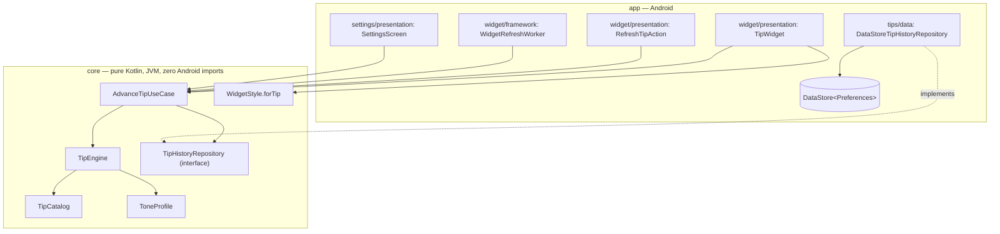

# SapGlance

**One card on your home screen. One line on it. Tap it for another.**

An Android widget that shows you something worth reading — an evidence-backed tip with the
studies attached, or a line of motivation, philosophy or wellbeing — and asks nothing in return.

## What it does

**The line is worth reading.** Most widgets in this category recycle the same unattributed
quotes and put an ad underneath. Here, every practical tip carries **two independent citations
you can open**, and every quotation names the public-domain edition it came from. Tap *Why this
tip?* and the sources are right there. Nothing else in the category shows you where the claim
came from, because nothing else has one.

**It knows what time it is.** Motivation leads the morning and is switched off entirely after
23:00, when a quiet reflection suits the hour better. The night pools are written for someone
actually awake at 3am — what still helps then, and deliberately not the frightening findings
that would only keep them awake. The artwork follows the same clock: pale cards in daylight,
deep ones at night, never a bright meadow behind a philosophy line at 3am.

**It doesn't repeat itself.** 316 tips across nine pools. The last 100 you have seen never come
back, the 60 before those are weighted down so the neglected ones actually surface, and no voice
runs three draws in a row.

**It waits until you have actually seen it.** The tip advances after roughly 90 minutes of
*confirmed screen-on time* — not a wall-clock timer rotating past you while the phone is face
down in a bag.

**It asks for nothing.** No account, no sign-up, no analytics, no crash reporter, no ads, no
notifications, no streaks. The manifest declares **no `INTERNET` permission at all**, so it
could not phone home even if a dependency wanted to. That is a structural guarantee rather than
a policy you have to believe — see [PRIVACY.md](PRIVACY.md).

It resizes from a 2x2 square to a 4x4 block, with a layout built for each end of that range
rather than one design stretched across it, and fifteen card backgrounds so a new tip means a
new-looking card.

## Architecture

Two Gradle modules, three features — `tips`, `settings`, `widget` — and the same three in both.
`:core` declares the interfaces and `:app` implements them, so `:core` needs no Android SDK at
all and stays unit-testable on a plain JVM. `SettingsRepository` and `WidgetRefreshRepository`
follow the same interface-in-`:core`, DataStore-in-`:app` shape as the one drawn above.

`:core` is flat per feature on purpose: a `model`/`usecase`/`port` split was tried and reverted
for turning 14 files into 8 folders, five holding one file each (`git log` has the measurement).
`:app` splits by layer, because those are real differences in kind — `data/` implements a
`:core` interface, `presentation/` is Compose and Glance, and `framework/` holds the four
classes **Android instantiates by name**. Those four are the expensive ones: their
fully-qualified names are in the manifest, and `TipWidgetReceiver`'s is the `ComponentName`
every placed widget is bound to, so renaming it drops widgets off home screens.

## How a tip is chosen

Three narrowing weighted picks: a **tier** (practical vs. tone), a **group** within it, then a
**tip**. Every group is filtered against the anti-repeat window *before* any draw, and a group
with nothing fresh left is dropped and its share redistributed among the survivors — weighting
first and filtering second was a real bug. If that still leaves nothing, the tone run limit
gives way before anti-repeat does: the first is a preference about which voice comes next, the
second is the product promise.

`VarietyLevel` sets the tone tier's share (20/50/80%) and never switches a tier off. Which tone
suits which hour is editorial rather than a setting: `ToneProfile` leads with motivation in the
morning and zeroes it at night. The reasoning for each of these sits in the KDoc where it
applies, and the behaviour is pinned by tests rather than by intention.

## More

- [CONTRIBUTING.md](CONTRIBUTING.md) — building, testing, and how to add a tip
- [ROADMAP.md](ROADMAP.md) — what is planned and what is blocking release
- [STATUS.md](STATUS.md) — what is verified, what is not, and the open risks
- [TIP_SOURCES.md](TIP_SOURCES.md) — the research behind every practical tip
- [PRIVACY.md](PRIVACY.md) — the privacy policy, also live at
  [alexanderkova033.github.io/SapGlance](https://alexanderkova033.github.io/SapGlance/)

## License

MIT — see [LICENSE](LICENSE).
